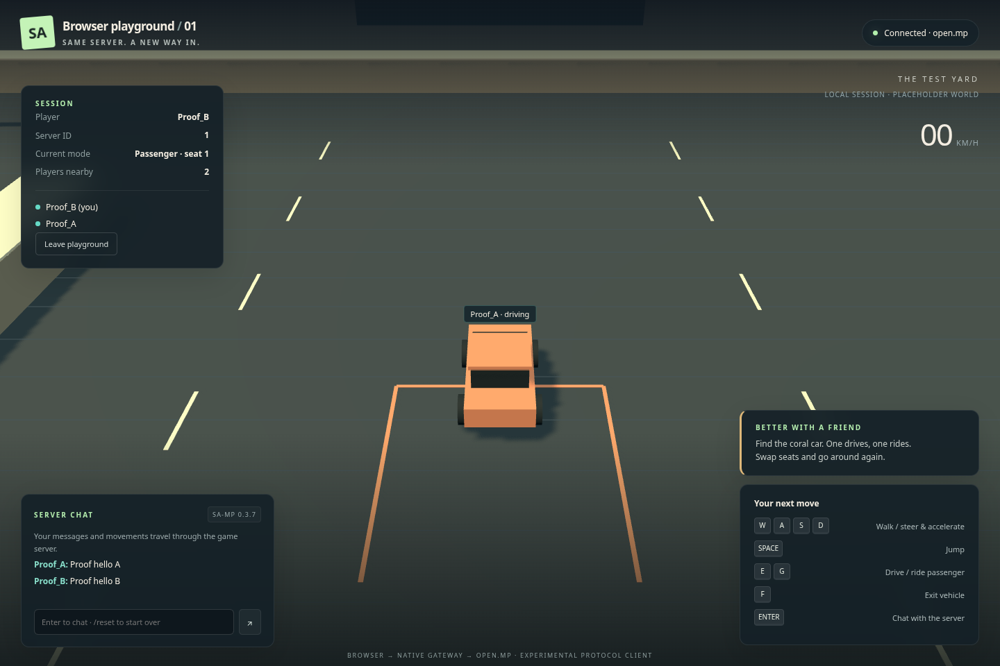

# SA Online Browser

A cloud-local browser multiplayer prototype: two players walk, chat, and share a placeholder arcade car through the SA-MP 0.3.7 protocol and an unchanged **open.mp v1.5.8.3079** server.

The browser renders and simulates locally. A Node WebSocket gateway starts one native C++ protocol worker per browser. All peer gameplay travels through the real upstream UDP server; the gateway does not broadcast gameplay between browsers.



## Run

On the supplied Amazon Linux cloud workspace with Node 24 and passwordless sudo:

```sh
npm run setup:poc
npm run dev:poc
```

In a second project terminal, run `npm run open:poc` to open the game in the cloud desktop with software WebGL enabled. Run it again for a second window, choose distinct nicknames, and join. The address, `http://127.0.0.1:3000`, belongs to the cloud workspace, not your Mac. The server and gateway bind to loopback. Stop the supervisor with Ctrl+C.

### WebGL startup errors

`GL_VENDOR = Disabled`, `BindToCurrentSequence failed`, or `Error creating WebGL context` means the browser could not create the graphics context. The playground requires [WebGL 2](https://threejs.org/docs/pages/WebGLRenderer.html). The supplied desktop's default Chrome can be launched with `--disable-gpu`; the earlier test suite explicitly enabled software rendering, so its success did not cover that browser configuration.

Use `npm run open:poc` for the cloud demo. It starts Chrome with SwiftShader in a dedicated `.runtime/playground-chrome` profile, using the same graphics flags as verification. A separate profile is essential: otherwise an existing Chrome process can open the window while ignoring the new flags. This launcher is for trusted local content; [Chromium documents that SwiftShader opt-in lowers security guarantees](https://chromium.googlesource.com/chromium/src/+/main/docs/gpu/swiftshader.md). Normal browsing should use your usual profile. Startup logs are in `.runtime/playground-chrome.log`.

Browsers without WebGL now show a recovery screen before joining a server. On a computer with a GPU, enable browser graphics acceleration and restart the browser, or use another browser with WebGL 2 support. Page JavaScript cannot enable a browser's disabled graphics backend.

Keep each game tab visible in its own window. Hiding or suspending a tab disconnects it; return and join again to resynchronize.
After an abrupt worker crash, the server can retain the nickname until its connection timeout expires. Wait for that slot to clear or use another nickname.

| Control | Action |
| --- | --- |
| W/A/S/D | Walk or drive |
| Space | Jump on foot |
| Enter | Chat |
| E / G | Request driver / passenger seat near the car |
| F | Exit the car |
| `/reset` / `/teleport` | Reset the fixture / teleport yourself |

The setup command installs build/Xvfb dependencies, verifies pinned downloads, compiles the fixture and native worker, installs Chromium, and builds the browser. It keeps Debian i386 libraries and QEMU isolated under `.runtime`; host system libraries are untouched. See [runtime instructions](test-server/README.md) and [native protocol details](native/README.md).

## Verify

Stop `dev:poc` first so ports 3000 and 7777 are available, then run:

```sh
npm run verify:poc
```

The suite runs type checks, gateway and native tests, then two independent headed Chromium sessions under Xvfb. Allow approximately thirteen minutes, including a ten-minute active multiplayer soak. It checks server observations and decoded browser snapshots as well as rendering. `POC_HEADLESS=1 npm run verify:poc` selects headless Chromium.

Screenshots, videos, traces, JSON results, and server observations are written to ignored `artifacts/verification/`. Gateway worker transitions are in `.runtime/logs/gateway.jsonl`. Reproduce these artifacts when moving to a fresh workspace; large recordings are not committed.

## Scope and project record

This demonstrates a narrow browser/open.mp protocol subset with original placeholder geometry. Original GTA clients, original SA-MP servers, arbitrary public servers, GTA assets, combat, realistic physics, WAN hosting, and hardware GPU performance are not verified. Software WebGL rendering is functional evidence only.

- [Accepted PoC specification](docs/poc-plan.md) and [scope decision](docs/decisions/0002-placeholder-poc.md)
- [Current status and continuation](docs/status.md)
- [Domain glossary](CONTEXT.md)
- [Protocol selection](docs/decisions/0001-protocol-and-scope.md), [long-horizon architecture](docs/architecture.md), and [roadmap](docs/roadmap.md)
- Research: [SA-MP/open.mp](docs/research/sa-mp.md), [MTA](docs/research/mta.md), [browser feasibility](docs/research/browser-runtime.md)

Original PoC code is **GPL-3.0-or-later**. Preserve [third-party licenses and notices](THIRD_PARTY_NOTICES.md), including installed agent skills. No GTA assets or executables are included.
