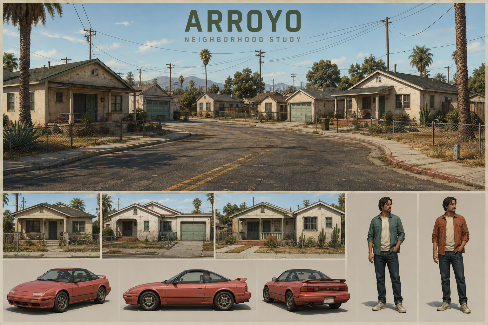

# SA Online Browser

A cloud-local browser multiplayer prototype: two players walk, chat, and drive an original sports coupe around Arroyo, a San Andreas-inspired neighborhood through the SA-MP 0.3.7 protocol and an unchanged **open.mp v1.5.8.3079** server.

The browser renders and simulates locally. A Node WebSocket gateway starts one native C++ protocol worker per browser. All peer gameplay travels through the real upstream UDP server; the gateway does not broadcast gameplay between browsers.



The image above is the original concept target. In-engine screenshots and measured results are recorded in [the neighborhood result record](docs/neighborhood-results.md).

## Run

On the supplied Amazon Linux cloud workspace with Node 24 and passwordless sudo:

```sh
npm run setup:poc
npm run dev:poc
```

In a second project terminal, run `npm run open:poc` to open the game in the cloud desktop with software WebGL enabled. Run it again for a second window, choose distinct nicknames, and join. The address, `http://127.0.0.1:3000`, belongs to the cloud workspace, not your Mac. The server and gateway bind to loopback. Stop the supervisor with Ctrl+C.

### WebGL startup errors

`GL_VENDOR = Disabled`, `BindToCurrentSequence failed`, or `Error creating WebGL context` means the browser could not create the graphics context. The playground requires [WebGL 2](https://threejs.org/docs/pages/WebGLRenderer.html). The supplied desktop's default Chrome can be launched with `--disable-gpu`; the earlier test suite explicitly enabled software rendering, so its success did not cover that browser configuration.

Use `npm run open:poc` for the cloud demo. It starts Chrome with SwiftShader in a dedicated `.runtime/playground-chrome` profile, using the same graphics flags as verification. A separate profile is essential: otherwise an existing Chrome process can open the window while ignoring the new flags. This launcher is for trusted local content; [Chromium documents that SwiftShader opt-in lowers security guarantees](https://chromium.googlesource.com/chromium/src/+/main/docs/gpu/swiftshader.md). Normal browsing should use your usual profile. Startup logs are in `.runtime/playground-chrome.log`.

Browsers without WebGL now show a recovery screen before joining a server. On a computer with a GPU, enable browser graphics acceleration and restart the browser, or use another browser with WebGL 2 support. Page JavaScript cannot enable a browser's disabled graphics backend.

Keep each game tab visible in its own window. Hiding or suspending a tab disconnects it; return and join again to resynchronize.
After an abrupt worker crash, the server can retain the nickname until its connection timeout expires. Wait for that slot to clear or use another nickname.

| Control | Action |
| --- | --- |
| W/A/S/D | Camera-relative walking; accelerate, brake and steer while driving |
| Right mouse drag / wheel | Orbit camera / zoom |
| Space | Jump on foot |
| Enter | Chat |
| E / G | Request driver / passenger seat near the car |
| F | Exit the car |
| `/reset` / `/teleport` | Reset the fixture / teleport yourself |

The setup command installs build/Xvfb dependencies, verifies pinned downloads, compiles the fixture and native worker, installs Chromium, and builds the browser. It keeps Debian i386 libraries and QEMU isolated under `.runtime`; host system libraries are untouched. See [runtime instructions](test-server/README.md) and [native protocol details](native/README.md).

## Verify

Stop `dev:poc` first so ports 3000 and 7777 are available, then run:

```sh
npm run verify:poc
```

The suite runs type checks, gateway and native tests, then two independent headed Chromium sessions under Xvfb. Allow approximately thirty minutes: the retained yard and new neighborhood each run a ten-minute active multiplayer soak, with additional loop, lifecycle and graphics tests. It checks server observations and decoded browser snapshots as well as rendering. `POC_HEADLESS=1 npm run verify:poc` selects headless Chromium.

Screenshots, videos, traces, JSON results, and server observations are written to ignored `artifacts/verification/`. Gateway worker transitions are in `.runtime/logs/gateway.jsonl`. Reproduce these artifacts when moving to a fresh workspace; large recordings are not committed.

For the actual cloud desktop, start `dev:poc` with no other players, then run `npm run verify:desktop`. It opens two Google Chrome windows on display `:1` (or `$DISPLAY`), checks walking/chat/driving and occupants through UI input, audits texture allocations, and saves screenshots, traces and server observations to `artifacts/desktop/`. This is separate from the Xvfb performance test. Close extra software-rendered game windows before performance verification.

## Scope and project record

This demonstrates a narrow browser/open.mp protocol subset with original placeholder geometry. Original GTA clients, original SA-MP servers, arbitrary public servers, GTA assets, combat, realistic physics, WAN hosting, and hardware GPU performance are not verified. Software WebGL rendering is functional evidence only.

- [Accepted PoC specification](docs/poc-plan.md) and [scope decision](docs/decisions/0002-placeholder-poc.md)
- [Current status and continuation](docs/status.md)
- [Domain glossary](CONTEXT.md)
- [Protocol selection](docs/decisions/0001-protocol-and-scope.md), [long-horizon architecture](docs/architecture.md), and [roadmap](docs/roadmap.md)
- Research: [SA-MP/open.mp](docs/research/sa-mp.md), [MTA](docs/research/mta.md), [browser feasibility](docs/research/browser-runtime.md)

Original PoC code is **GPL-3.0-or-later**. Preserve [third-party licenses and notices](THIRD_PARTY_NOTICES.md), including installed agent skills. No GTA assets or executables are included.

## Neighborhood and editable assets

`npm run dev:poc` selects Arroyo by default. `POC_SCENE=yard npm run dev:poc` retains the original test yard. Scene selection is a server setting; browsers load the selected manifest before joining. A stale manifest or asset hash produces an explicit loading/join error. Restart the demo after changing manifests or exports.

Use **Low graphics** in the cloud desktop. It uses reduced internal render resolution, baked vertex shading and simplified fence wires. **Standard** uses full-resolution PBR materials and soft shadow maps. The HUD remains at display resolution in both modes. The minimap shows north, players and the car; chat collapses through its heading, and the top-right diagnostics button reveals protocol details. Keep each player tab visible in its own window.

```sh
npm run build:assets                 # installs pinned Blender 4.5.13 in .runtime if absent
node tools/create-scenes.mjs          # regenerate the committed layout manifests
npm run build:browser
```

Normal `setup:poc` consumes committed GLBs and image inputs; it does not install Blender or call an image service. Edit `tools/assets/build.py` to regenerate the kit, or inspect the editable `assets/source/*.blend` files. The script is the authoritative source; rebuilding replaces those .blend exports. Geometry is modeled in meters, Z-up and +Y forward, normalized once after glTF loading. Texture inputs, prompts, licenses and source pins are in [asset provenance](assets/PROVENANCE.md). The imagegen authoring skill is included under `.agents/skills/imagegen` with its own license.

The [accepted plan](docs/neighborhood-plan.md) defines the current scope. Next: a shared checkpoint driving challenge, then private remote invitations and latency testing, then an original GTA/SA-MP interoperability slice. Arroyo's custom map does not establish native GTA world compatibility.
