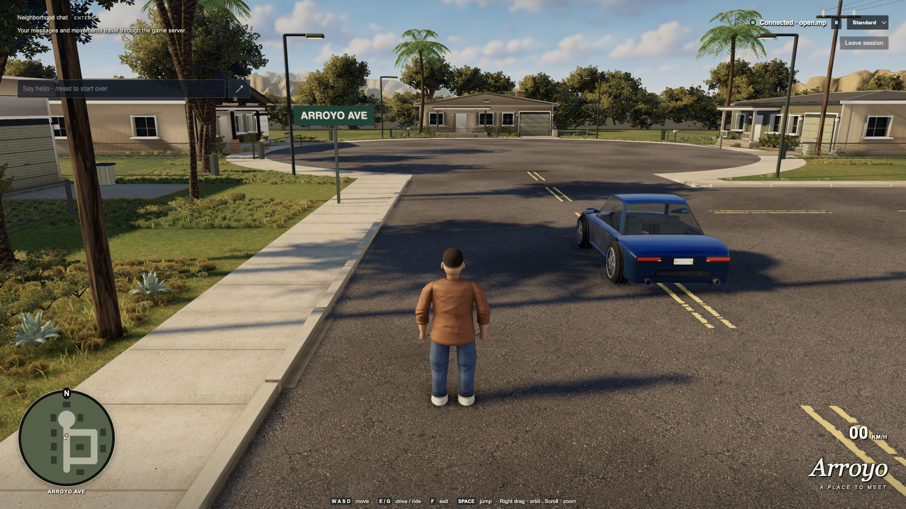

# SA Online Browser

A cloud-local browser multiplayer prototype: two players walk, chat, and drive an original sports coupe around Arroyo, a San Andreas-inspired neighborhood through the SA-MP 0.3.7 protocol and an unchanged **open.mp v1.5.8.3079** server.

The browser renders and simulates locally. A Node WebSocket gateway starts one native C++ protocol worker per browser. All peer gameplay travels through the real upstream UDP server; the gateway does not broadcast gameplay between browsers.



The image above shows the accepted round-seventeen build in native Chrome. Complete native motion, four isolated performance cases and the [full 15-scenario acceptance with both supervisor checks](docs/native-acceptance-round17a/summary.json) passed. The latest formal art score is still 5.0/10, below the visual target. The [native results](docs/native-dream-results.md) retain exact build identities, the measured quality-cycle pixel differences and validation limits. Movement interpolates the fixed 60 Hz simulation, and original assets can be rebuilt with native Blender on macOS. The [generated concept](docs/images/native-concept-2026-09-13.png) is reference art, not a game screenshot; [earlier neighborhood results](docs/neighborhood-results.md) remain historical.

The first final-source acceptance attempt stopped at two source checks before
browser tests. Their [validation repair](docs/native-validation-repair-round17.json)
preserves the failed run and leaves the measured runtime unchanged. The corrected
full run passed on `2a6ffde`; its archived evidence remains separate.

## Play Arroyo Loop

The current build adds a server-scored nine-checkpoint driving activity, original neighborhood props and spatial sound. Enter the coupe with **E** (driver) or **G** (passenger), return to the marked start, and press **R**. Stay still during the countdown, follow the gates, then swap seats for a rematch. **H** sounds the horn; **Space** is the driving handbrake. The activity panel shows the server-session top five. Chat commands: `/race`, `/cancel`, `/scores`. Sound unlocks on interaction; the HUD provides mute and volume controls.

See [game-feature results and remaining verification gaps](docs/working-game-results.md). The native evidence above predates this feature integration. Run `npm run verify:activity` for its focused multiplayer regression.

## Run in Docker

Docker keeps the compiler, CMake, Python, the pinned open.mp fixture and the
native worker inside an image, so none of them are installed on your own
machine. Your browser stays on the host, where it renders the scene on your
real GPU instead of the software rasterizer the cloud desktop needs.

Start the server:

```sh
docker compose --profile server up --build
```

Then open <http://127.0.0.1:3000> in your own browser, and a second window for
the second player. Choose distinct nicknames and join. `Ctrl+C` stops it.

For development, start the toolchain container and work inside it:

```sh
docker compose --profile dev up -d --build dev
docker compose --profile dev exec dev bash
# inside the container:
npm run dev:poc
```

The image arrives already provisioned, so there is no setup step:
`npm run typecheck`, `npm run test:gateway`, `npm run build:browser`,
`npm run verify:poc` and `npm run dev:poc` are available immediately. On Apple
Silicon, use the native browser test host below if emulated Chromium cannot
start. The source
directories are mounted from the checkout, so edits on the host apply to the
next command; verification output appears in `artifacts/`. Stop the container
with `docker compose --profile dev down`.

Everything generated stays inside the container: `node_modules`, the
provisioned `.runtime`, the RakNet checkout, the native build and the browser
bundle. That split is deliberate. Docker Desktop for Mac silently drops a
volume mounted inside a bind mount and writes to the checkout instead, so the
checkout is not mounted at `/work` as a whole; `docker-compose.yml` lists
source paths individually. Adding a new source directory means adding it
there too. Incremental state lives in the container's own filesystem, so keep
the container between sessions rather than using `run --rm`, and rebuild the
image after dependency changes or edits to files that are not mounted. If an
editor replaces a singly mounted file such as `package.json` atomically and the
container still sees the old contents, stop the demo and run
`docker compose restart dev` to refresh the mount before the next build.

Both images are `linux/amd64`: the pinned open.mp release is an i386
executable and the QEMU that runs it is an x86_64 binary. On an Apple Silicon
Mac, Docker Desktop emulates that platform, so builds and the fixture run
noticeably slower than on native hardware. Browser rendering is unaffected —
it happens on the host.

The fixture's own directory is a `tmpfs` mount in both services. Its 32-bit
executable cannot represent the 64-bit directory offsets that overlayfs and
ext4 report and aborts while scanning its components; `tmpfs` keeps those
offsets inside a 32-bit `long`. Files the server writes there, including its
`log.txt`, do not survive a restart, but the supervisor's copy of its output
in `.runtime/logs/server.log` does.

Both services publish port 3000 to `127.0.0.1` only, so the fixture is not
reachable from the local network. Set `POC_PORT` to publish elsewhere and
`POC_SCENE` to select `yard` instead of `neighborhood`.

`npm run open:poc` is for the cloud desktop and does not apply here; the
container has no display, and your host browser is the point. Asset authoring
can run on the host with native Blender 5.2.1. Selective non-oak models and
terrain also support 4.5.13; the oak accessibility bake is verified with 5.2.1.
On macOS the builder
detects `/Applications/Blender.app`; run `npm run build:assets -- --skip-reflections`
on the host to avoid the Linux runtime and its browser dependencies.

To put this on the internet instead of localhost, see
[deployment instructions](DEPLOYMENT.md): the browser client goes to Vercel and
this same `server` image runs the gateway and fixture on a container host.

## Run on the cloud workspace

On the supplied Amazon Linux cloud workspace with Node 24 and passwordless sudo:

```sh
npm run setup:poc
npm run dev:poc
```

In a second project terminal, run `npm run open:poc` to open the game in the cloud desktop with software WebGL enabled. Run it again for a second window, choose distinct nicknames, and join. The address, `http://127.0.0.1:3000`, belongs to the cloud workspace, not your Mac. The server and gateway bind to loopback. Stop the supervisor with Ctrl+C.

### WebGL startup errors

`GL_VENDOR = Disabled`, `BindToCurrentSequence failed`, or `Error creating WebGL context` means the browser could not create the graphics context. The playground requires [WebGL 2](https://threejs.org/docs/pages/WebGLRenderer.html). The supplied desktop's default Chrome can be launched with `--disable-gpu`; the earlier test suite explicitly enabled software rendering, so its success did not cover that browser configuration.

Use `npm run open:poc` for the cloud demo. It starts Chrome with SwiftShader in a dedicated `.runtime/playground-chrome` profile, using the same graphics flags as verification. A separate profile is essential: otherwise an existing Chrome process can open the window while ignoring the new flags. This launcher is for trusted local content; [Chromium documents that SwiftShader opt-in lowers security guarantees](https://chromium.googlesource.com/chromium/src/+/main/docs/gpu/swiftshader.md). Normal browsing should use your usual profile. Startup logs are in `.runtime/playground-chrome.log`.

Browsers without WebGL now show a recovery screen before joining a server. On a computer with a GPU, enable browser graphics acceleration and restart the browser, or use another browser with WebGL 2 support. Page JavaScript cannot enable a browser's disabled graphics backend.

Keep each game tab visible in its own window. Hiding or suspending a tab disconnects it; return and join again to resynchronize.
After an abrupt worker crash, the server can retain the nickname until its connection timeout expires. Wait for that slot to clear or use another nickname.

| Control | Action |
| --- | --- |
| W/A/S/D | Camera-relative walking; accelerate, brake and steer while driving |
| Right mouse drag / wheel | Orbit camera / zoom |
| Space | Jump on foot; handbrake while driving |
| Enter | Chat |
| E / G | Request driver / passenger seat near the car |
| F | Exit the car |
| `/reset` / `/teleport` | Reset the fixture / teleport yourself |

The setup command installs build/Xvfb dependencies, verifies pinned downloads, compiles the fixture and native worker, installs Chromium, and builds the browser. It keeps Debian i386 libraries and QEMU isolated under `.runtime`; host system libraries are untouched. See [runtime instructions](test-server/README.md) and [native protocol details](native/README.md).

## Verify

Stop `dev:poc` first so ports 3000 and 7777 are available, then run:

```sh
npm run verify:poc
```

The suite runs type checks, gateway and native tests, then two independent headed Chromium sessions under Xvfb. Allow approximately thirty minutes: the retained yard and new neighborhood each run a ten-minute active multiplayer soak, with additional loop, lifecycle and graphics tests. It checks server observations and decoded browser snapshots as well as rendering. `POC_HEADLESS=1 npm run verify:poc` selects headless Chromium.

Screenshots, videos, traces, JSON results, and server observations are written to ignored `artifacts/verification/`. Gateway worker transitions are in `.runtime/logs/gateway.jsonl`. Reproduce these artifacts when moving to a fresh workspace; large recordings are not committed.

On Apple Silicon, Chromium's GPU process can fail under Docker's x86 emulation.
With Node 24, this checkout's pinned npm dependencies, and Google Chrome installed
on the Mac, run this in a host terminal:

```sh
caffeinate -dimsu -t 14400 node tools/acceptance-browser-server.mjs
```

Then run the same acceptance suite in the development container:

```sh
docker compose exec -T \
  -e POC_BROWSER_WS_ENDPOINT=ws://host.docker.internal:9344/sa-online-acceptance \
  dev npm run verify:poc
```

The native browser runs in isolated profiles; Playwright tunnels its loopback
requests back to the unchanged Linux fixture. The suite records the actual
Chrome version and WebGL renderer and preserves videos, full-resolution checks,
real hidden-tab cleanup, and both ten-minute soaks. Its host adapter is pinned to
Playwright 1.59.1. Keep the Mac awake throughout the run; system sleep invalidates
timing and sustained-session evidence. Stop the host with Ctrl+C after testing.

For native macOS Chrome with remote debugging on loopback port 9333, start `dev:poc` with no players and run `node tools/verify-native-rendering.mjs`. It opens four owned windows in sequence, checks full native DPR at two viewport sizes, measures idle/walking frame times and logical texture allocations, verifies served source/asset identities, and closes its windows. `node tools/verify-motion.mjs` separately exercises real UI/server movement and transitions in two owned native windows.

For the actual cloud desktop, start `dev:poc` with no other players, then run `npm run verify:desktop`. It opens two Google Chrome windows on display `:1` (or `$DISPLAY`), checks walking/chat/driving and occupants through UI input, audits texture allocations, and saves screenshots, traces and server observations to `artifacts/desktop/`. This is separate from the Xvfb performance test. Close extra software-rendered game windows before performance verification.

## Scope and project record

This demonstrates a narrow browser/open.mp protocol subset with an original neighborhood. Original GTA clients, original SA-MP servers, arbitrary public servers, GTA assets, combat, realistic physics, and WAN hosting are not verified. Native Chrome on Apple M5 Pro has been measured separately; software WebGL rendering remains functional evidence only.

- [Accepted PoC specification](docs/poc-plan.md) and [scope decision](docs/decisions/0002-placeholder-poc.md)
- [Current status and continuation](docs/status.md)
- [Domain glossary](CONTEXT.md)
- [Protocol selection](docs/decisions/0001-protocol-and-scope.md), [long-horizon architecture](docs/architecture.md), and [roadmap](docs/roadmap.md)
- Research: [SA-MP/open.mp](docs/research/sa-mp.md), [MTA](docs/research/mta.md), [browser feasibility](docs/research/browser-runtime.md)

Original PoC code is **GPL-3.0-or-later**. Preserve [third-party licenses and notices](THIRD_PARTY_NOTICES.md), including installed agent skills. No GTA assets or executables are included.

## Neighborhood and editable assets

`npm run dev:poc` selects Arroyo by default. `POC_SCENE=yard npm run dev:poc` retains the original test yard. Scene selection is a server setting; browsers load the selected manifest before joining. A stale manifest or asset hash produces an explicit loading/join error. Restart the demo after changing manifests or exports.

**Standard is the default for new installations**; explicitly saved preferences are preserved. **Low** remains an optional fallback. Both presets render at the full viewport resolution and native device pixel density, without a resolution cap or automatic downscaling. Low uses baked vertex shading and simplified fence wires; **Standard** uses physical materials, cached neighborhood reflections, contact shading, and soft shadow maps. The software-rendering target is 4 FPS for two cloud views; report slower results without reducing resolution. The September 13 native Chrome audit passed the 60 FPS median target in both presets at 2560×1440 and 3344×1882 drawing buffers. The [native rendering record](docs/native-rendering-verification.json) identifies the exact measured scene and source hashes; cloud measurements are not estimates of hardware performance. The minimap shows north, players and the car; chat collapses through its heading, and the top-right diagnostics button reveals protocol details. Keep each player tab visible in its own window.

```sh
npm run build:assets                 # Blender 5.2.1 + reflection bake; macOS app detected automatically
npm run build:assets -- --models tree,palm,garden-low --skip-reflections
BLENDER_BIN=/path/to/blender-5.2.1 npm run build:assets -- --skip-reflections
node tools/build-assets.mjs --models coupe --output-root .dream-loop/coupe-check --skip-reflections
node tools/create-scenes.mjs          # regenerate the committed layout manifests
npm run build:browser
```

Normal `setup:poc` consumes committed GLBs and image inputs; it does not install Blender or call an image service. Edit `tools/assets/build.py`, `environment-kit.py`, `garden-kit.py`, and `heroes.py` to regenerate the ordinary kit, or inspect the editable `assets/source/*.blend` files. Oaks use the declared native inputs in [canopy-base](assets/source/canopy-base/README.md) and `tools/assets/canopy-visibility.py`; a structural oak edit requires a new declared base and fresh visibility bake. Runtime exports are never their own build inputs. Builds use scratch space and publish only complete successful exports. `--models` replaces only the named models; dependencies may still be constructed. `assets/source/asset-build.json` records the actual Blender version, executable hash, recipe hashes, and output identities per rebuilt model. `--output-root` supports isolated checks and requires `--skip-reflections`.

On Linux, full builds and oak builds require an explicitly installed Blender 5.2.1 executable through `--blender` or `BLENDER_BIN`. The automatically downloaded 4.5.13 build remains available for selective non-oak models and terrain; oak compatibility with that version has not been verified.

After final model or scene changes, run `node tools/bake-reflections.mjs` in the provisioned container and restart the gateway. With the fixture already running and native Chrome debugging available on loopback port 9333, `node tools/bake-reflections-native.mjs` instead captures the actual host GPU and checks source, served bundle and asset identities before publication. The reflection bake uses installed pinned Chromium without player connections, saves a lossless RGBA16F atlas and provenance under `assets/source/reflection-bake.json`, and refreshes the asset inventory and browser build. Geometry is modeled in meters, Z-up and +Y forward, normalized once after glTF loading. Texture inputs, prompts, licenses and source pins are in [asset provenance](assets/PROVENANCE.md). The imagegen authoring skill is included under `.agents/skills/imagegen` with its own license.

The [accepted plan](docs/neighborhood-plan.md) defines the current scope. Next: a shared checkpoint driving challenge, then private remote invitations and latency testing, then an original GTA/SA-MP interoperability slice. Arroyo's custom map does not establish native GTA world compatibility.
