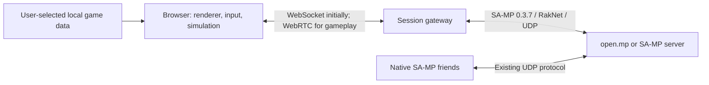
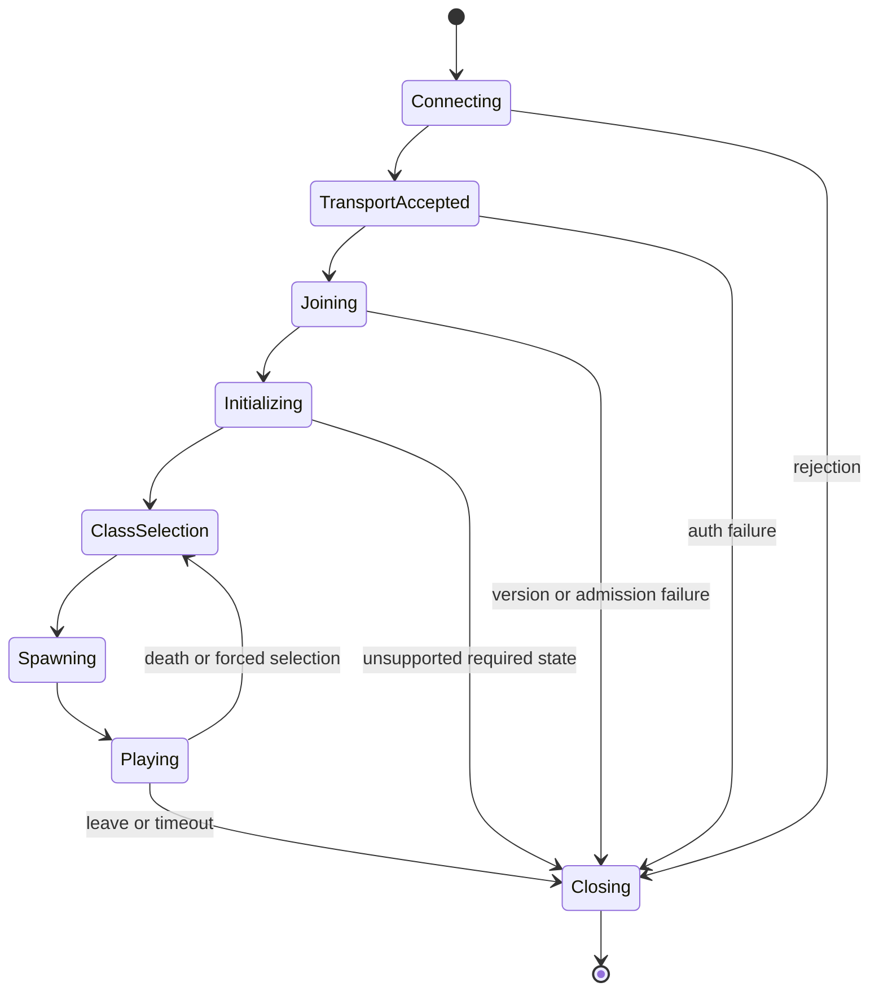

# Proposed architecture

Date: 2026-09-07. Design proposal; no components have been implemented.

## End-to-end boundary



The browser and gateway together form the replacement client. No GTA executable runs in the gateway. Native friends connect normally. The first test server runs a small gamemode, but requires no new browser transport plugin or alternate player API.

## Components and ownership

| Component | Owns | Does not establish |
| --- | --- | --- |
| Browser runtime | Input, camera, collision, local player/vehicle simulation, remote interpolation, UI/audio, asset streaming | Server acceptance merely by rendering a convincing scene |
| Browser session layer | Versioned control/state messages, lifecycle, bounded queues, reconnect UI | Direct access to arbitrary UDP sockets |
| Gateway front end | Authenticated sessions, destination allowlist, WebSocket/WebRTC termination, quotas | Native GTA integrity or permission to bypass server admission |
| Native protocol worker | UDP session, legacy handshake, RakNet delivery, RPC codecs, pool/lifecycle state, translation | Full GTA simulation; ordinary packet acceptance proves only part of gameplay |
| Existing game server | Gamemode, allowed spawns, entity streaming, commands, rule validation | All moment-to-moment GTA physics; client simulation still matters |

**Working stack:** TypeScript for browser and shared web message schemas, WebGL2 for the first renderer, C++/CMake for the native protocol experiment. Choose renderer/physics and WebRTC libraries after a small measured experiment and license check. WebGPU is a later optimization. Avoid a framework commitment merely to draw the first test scene.

Start with one native worker process per browser player if the old RakNet code's global state prevents safe independent sessions. Measure memory and CPU before consolidating sessions; do not assume the upstream library supports multiple isolated clients in one process.

## Two network legs, two delivery contracts

1. **Gateway to legacy server:** implement the exact observed SA-MP variant of RakNet 2.52, including connection setup, direction-specific obfuscation, auth, RPC framing, acknowledgements, fragmentation, retransmission, ordering and timeouts. Use audited upstream code where practical; stock modern RakNet is not a proven replacement. The inspected open.mp fork is server-oriented, so its `RakClient` class being present is not evidence of client interoperability. [Detailed source findings](research/sa-mp.md).
2. **Browser to gateway:** use a separate, versioned application protocol. The initial secure WebSocket carries control and state for debugging. Before driving tests, add WebRTC with reliable ordered control and unordered, non-retransmitted state snapshots. WebTransport is an alternative experiment, not an automatic raw-UDP tunnel. [WebRTC DataChannel specification](https://www.w3.org/TR/webrtc/), [WebTransport specification](https://www.w3.org/TR/webtransport/).

After native termination, do not encapsulate already-reliable RakNet frames in another reliability layer. Decode once and translate semantics. Preserve control order and send snapshot sequence numbers, session epochs and entity generations so a delayed movement packet cannot resurrect an entity. Separate channels have no cross-channel ordering: include a control revision or readiness barrier so motion cannot overtake a spawn, teleport or seat change, even for the same entity generation. Coalesce superseded motion, bound buffered bytes and disconnect or resynchronize slow clients instead of accumulating delay. WebSocket can remain a degraded fallback; label and measure its behavior under packet loss.

The gateway belongs near the game server. Account for both browser-to-gateway and gateway-to-server delay and TURN relay paths. ICE/STUN/TURN and TLS configuration are deployment requirements for WebRTC, not evidence of native-server compatibility.

## Session state machine



This is a conceptual lifecycle, not an asserted complete packet ordering. M1 must derive the precise transitions, conditional branches, messages and timers from pinned source and observed sessions. A reconnect creates a fresh upstream session and epoch unless the protocol demonstrably supports resumption. A server query response is not a join; a player-list entry is not a completed spawn.

## Codec and simulation design

Document every supported message by direction, ID, bit layout, required state, delivery mode and provenance before implementing it. Client-to-server and server-to-client schemas can differ even for one logical message: open.mp's on-foot sync reader and writer use different fields and compression. Self round-trip tests alone cannot establish compatibility. [On-foot sync source](https://github.com/openmultiplayer/open.mp/blob/c6759bd8d265171ae3d86598895a23d5a8d92a3b/Shared/NetCode/core.hpp#L1587).

Use explicit bit reads/writes, length checks, finite numeric validation and documented coordinate/quaternion conversions. Treat packet buffers as untrusted. Fixtures must come from independent server/native observations and include bit lengths, configuration, hashes and expected decoded meaning.

The runtime needs a fixed simulation step decoupled from rendering and network ticks. Reproduce the tested character/vehicle behavior well enough that native clients see plausible movement and the gamemode accepts it. Use server-provided sync settings; do not hard-code a convenient send rate. Interpolate remote snapshots, reconcile local state on server teleports/health/spawn commands, and make ownership explicit for driver, passenger, unoccupied vehicle and entity streaming. Deterministic lockstep with the GTA engine is not assumed.

## Assets

Begin protocol and graphics tests with original placeholder geometry in a known test area. A browser user can later select local files; build an incremental importer/cache rather than loading the entire game into RAM. Candidate format work includes IMG indexing, IDE/IPL placement, DFF meshes, TXD textures, COL collision and IFP animations. Imported data should remain local by default, with versioned derived caches and bounded workers. [Browser/engine evidence and limitations](research/browser-runtime.md).

An engine's open-source license does not cover GTA game assets. Track provenance for each engine dependency, format implementation, placeholder and supported data set. A local import design is not a legal determination about redistribution or conversion. Do not put GTA executables, textures, audio, models, installers, or private packet recordings into the public repository. Use synthetic or reviewed redistributable fixtures in CI.

## Operational constraints to design for

- One destination selected from configured server IDs per session; the gateway must not become an arbitrary UDP relay. Resolve and validate targets server-side; a controlled private server can be explicitly configured.
- Validate origin/session ownership, message sizes, packet rates and worker resource limits. Keep server passwords and player identifiers out of normal logs.
- Measure shared gateway-IP admission limits and reconnect collisions with multiple real sessions. Do not change or fabricate identities to evade bans or required custom-client checks.
- Pause/suspend browser behavior must be explicit: no minutes of queued motion on returning to a tab. Test timeout, background throttling and fresh reconnection.
- Maintain metrics for each leg's latency, snapshot age, queue depth, dropped states, unknown RPCs, rejection reasons and per-session resource usage.

## Proposed repository layout after feasibility passes

```text
apps/browser/              Browser runtime and user interface
services/gateway/          Session service and native protocol workers
packages/web-protocol/     Versioned browser/gateway message definitions
protocol/sa-mp-037/        Direction-specific protocol notes and codecs
fixtures/                 Reviewed synthetic/golden packet cases
test-server/              Pinned server recipe and minimal gamemode
tools/                    Capture, replay and comparison utilities
docs/                     Evidence, decisions, status and compatibility
```

These directories are proposed, not present implementation. Keep the browser transport and SA-MP codec separate so either can change without rewriting simulation.
