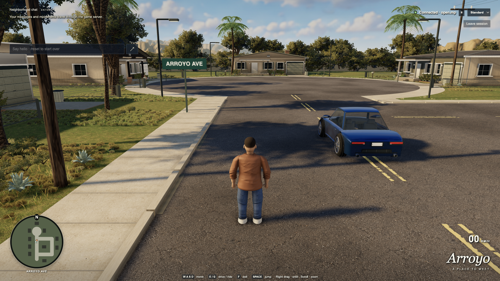

# Native Dream-loop results

The accepted **round-seventeen build** passed complete native motion and four
isolated rendering cases. The full **15-scenario acceptance and both supervisor
checks remain pending**. The latest formal [art review](art-review-round13-2026-09-13.md)
is still judge thirteen's **5.0/10, Tier 1**; the visual target remains open.
No new formal score or ready declaration is assigned.

The tested scene is **`fc8deb6a7bbf6a35`**, served by `main-DrSvmP81.js`, SHA256
`74b07ba647aeaacad338c14d62d7944e59821c4744ddfe35164f6f92e8ca0e2f`.
The [integration record](native-integration-round17.json) retains exact tested
sources, delivered assets, authoring and focused-check results. The final round
eighteen terrain specimen was rejected after actual native inspection; it was
not integrated into this build.

## Current appearance and authoring

This is an actual Standard gameplay capture from a native 3344×1882 drawing buffer,
captured directly at 1672×941 with CDP and copied without image editing. Its
[metadata](images/native-street-round17-2026-09-13.json) and the
[quality record](native-quality-cycle-round17.json) identify the image and source
bracket. The [generated target](images/native-concept-2026-09-13.png) remains
reference art.

Native Blender 5.2.1 replaces the trouser's repeated transverse knee bands with
localized asymmetric folds and refines the ankle/cream shoe boundary. The final
6,521,848-byte character retains 121,590 triangles. Every vertex/skin attribute,
material, inverse bind and animation stream matches the accepted preview; only
triangle submission order differs in four existing primitives. Original outfit,
body, rig and seat contracts remain. The prior oak, palm, road/curb, frontage
planting and accepted terrain work is retained.

The accepted olive lawn pigment uses the same world field on ground and turf.
Short grass fills unpaved house approaches using existing geometry and material.
An actual-footprint test removed eight tufts around a lamp base; all 9,285
surviving matrix/color bytes remain exact. All grass totals **64 batches /
714,924 triangles**, below the unchanged caps. The rebuilt static PMREM contains
11,647,597 compressed bytes and has finite peak linear radiance 7.4765625.

Three Standard → Low → Standard cycles completed without browser errors.
**Strict pixel equality failed:** 30 of 35 static-region comparisons were exact;
the five car-rear comparisons each differed at one pixel by one color level at
the exhaust edge. No tolerance was substituted and no complete bitwise-equality
claim is made. Quality and motion kept **107 source, 28 asset and 4 served-file
identities** exact before and after their runs.

Focused assets/character tests passed **6/6**, verges clearance/budget tests
**5/5**, and typecheck passed. The initial reflection command had a filename typo
and ran no tests; the corrected command passed **2/2**. Both outcomes are retained.

## Current native rendering

Chrome **153.0.8010.37**, **ANGLE Metal on Apple M5 Pro**, native DPR 2. The
isolated audit completed at **14:39:59 UTC** on September 13, with five seconds
warmup, twenty seconds idle and four seconds walking per fresh owned window.

| Preset / CSS viewport | Native drawing buffer | Idle / walking median FPS | p95 idle / walking | Logical texture storage |
| --- | --- | ---: | ---: | ---: |
| Standard, 1280×720 | 2560×1440 | 120.48 / 120.48 | 9.1 / 9.0 ms | 266.00 MiB |
| Low, 1280×720 | 2560×1440 | 120.48 / 120.48 | 9.0 / 9.1 ms | 119.34 MiB |
| Standard, 1672×941 | 3344×1882 | 120.48 / 120.48 | 9.0 / 8.9 ms | 315.72 MiB |
| Low, 1672×941 | 3344×1882 | 120.48 / 120.48 | 9.0 / 9.1 ms | 169.06 MiB |

Maximum sampled scene download was **46,972,136 bytes**; measured encoded native
network total was **46,985,679 bytes**. Maximum sampled geometry was
**5,352,079 triangles / 954 calls**. All unchanged download, texture, triangle,
draw-call and 60 FPS gates passed, with no browser errors or stalls over 50 ms.
The selected disconnected reference target's frame count stayed **710,862**
through every measured phase and it was left frozen. See the
[rendering record](native-rendering-round17-summary.json).

Logical texture storage excludes driver overhead and renderbuffers; maxima are
sampled. These bounded hardware measurements do not promise constant 120 FPS on
every route or device.

## Current native motion and pending acceptance

The **complete all-case motion process exited zero** on this exact build.
Real UI/server checks covered walking, driving, steering, teleport/reset,
jump/seat/exit, two-player replication and both car occupants. Both jump/seat/exit
cases recorded zero uncommanded upward motion. Resetting the occupied moving car
after 7.170 m of driving produced first corrections at 223.6/232.1 ms for driver
and passenger; local body and car presentation errors were zero. Two-player
motion still has network variation: two repeated remote positions in 280 frames
and 24.25% speed variation, so zero remote stutter is not claimed.

Both owned motion windows were independently confirmed absent, and health
returned to zero sessions/workers. See the
[complete motion record](native-motion-round17-summary.json). This bounded probe
does not replace the pending full multiplayer suite.

The historical full native run finished **14 passed / 1 failed**. The subsequent
empty-page heartbeat control and unchanged worker-recovery case passed, but
those focused results are not a full acceptance pass. A fresh unfiltered
`verify:poc`, including both supervisor checks, is required after this final
source/asset freeze. Earlier reset-observer controls and focused soak evidence
remain in the [acceptance record](native-acceptance-environment.md).

## Earlier round-fifteen milestone (historical)

The following text preserves the earlier build, measurements and pending items.
The round-seventeen results above supersede its current-status claims; its raw
records and images remain unchanged.

Round fifteen is a measured integration milestone, not final acceptance. The
latest formal [art review](art-review-round13-2026-09-13.md), from round thirteen,
remains **5.0/10, Tier 1**. Round fifteen's readiness review is **NOT READY**;
there is no new formal score. Final-source motion and the complete multiplayer
acceptance suite remain pending.

The tested scene is **`f7da0f68c9f8ca5a`**, served by `main-zC6pAPDJ.js`, SHA256
`3800c0733bec7cc47a1b6dd45b0ab82486be491097df292b7633922566232741`.
The [integration record](native-integration-round15.json) identifies the working
tree changes on base `fe6f25f`; that base commit alone does not contain the
milestone. Exact tested sources and delivered assets are retained in the
[rendering record](native-rendering-round15-summary.json).

### Current appearance and authoring

This is an actual Chrome gameplay capture rendered at 3344×1882 native pixels
and captured directly at 1672×941 for comparison. The
[capture record](images/native-street-round15-2026-09-13.json) identifies its
source bracket and image hash. It was copied without resizing or editing.
The [generated target](images/native-concept-2026-09-13.png) remains reference art.

Native Blender 5.2.1 adds raw, alpha-aware diffuse accessibility to the two oak
specimens. Original leaf geometry, normals, UVs and materials remain exact;
only indirect diffuse light receives the new field. The narrower roadside trunk
has a separately declared native base and fresh visibility bake. Runtime outputs
are not recycled as authoring inputs. This improves local depth but does not
establish the broad golden crown faces requested by the concept.

The terrain retains its 172,800 triangles and one baked diffuse-irradiance field,
with connected upper gullies and a matching editable native source. Sparse road
cracks and circular-sidewalk deposits reuse existing maps, adding 4,224 triangles
and 295,680 buffer bytes. Exactly 36 shrubs move into clear frontages around the
three cul-de-sac houses; the total remains 141. Actual exported-geometry checks
preserve roads, doors, porches and other fixture exclusions. The earlier coupe
rear recesses, open-mouth exhaust and original rig/seat/wheel contracts remain;
see the [round-fourteen proof](native-integration-round14.json).

The rebuilt static reflection atlas is 1536×2048, 11,647,908 compressed bytes,
and peaks at 7.4765625 in linear radiance. Its exact source and asset identities
are retained in the integration record; no new reflection-brightness claim is
made. Earlier rejected lighting and terrain studies remain historical evidence.

Three real Standard → Low → Standard cycles kept native resolution and reported
no rendering errors. All **35 same-preset static-region comparisons** were
pixel-identical, including road, curb, terrain, lawn, crowns and car. The
[quality record](native-quality-cycle-round15.json) brackets all **106 sources,
28 assets and 4 served resources** with exact before/after hashes and successful
owned-window cleanup. Actor animation is excluded from these comparisons.

The first focused source/asset test batch recorded **35 passes and 2 failures**:
a stale terrain hash expectation and an isolated fixture missing the newly
imported canopy helper. After correction, terrain passed **9/9**; the rebuilt
reflection cache passed **2/2**. These separate results do not turn the first
run into a 37/37 pass. Full final-source tests remain required.

A later native walkthrough completed four views in **36.791 seconds**, using
ordinary on-foot movement, right-drag orbit and wheel zoom. The narrower trunk,
front beds and rear trim were visible without obvious clipping in the inspected
views. Source/asset/served fingerprints stayed exact; keys were released, the
owned target closed and disappeared, and sessions/workers returned to zero.
The failed first attempt stopped before joining because native select-key input
did not change quality; it is retained separately. This successful walkthrough
is visual inspection, not full interaction or performance acceptance.

The whole-frame lighting gate remains open: dominant foliage still reads as dark
olive masses rather than connected golden faces, the left lawn remains even,
and cool recessed mountain bands are not sufficiently readable. The readiness
opinion assigns no new score. Historical
[round-fourteen rendering](native-rendering-round14-summary.json) and
[round-fourteen quality](native-quality-cycle-round14.json) records remain intact.

### Native rendering

Chrome **153.0.8010.37**, **ANGLE Metal on Apple M5 Pro**, native DPR 2. Each fresh
context used five seconds of warmup, twenty seconds idle and four seconds walking.
The isolated audit completed at **13:51:59 UTC** on September 13.

| Preset / CSS viewport | Native drawing buffer | Idle / walking median FPS | p95 idle / walking | Logical texture storage |
| --- | --- | ---: | ---: | ---: |
| Standard, 1280×720 | 2560×1440 | 120.48 / 120.48 | 9.1 / 8.8 ms | 266.00 MiB |
| Low, 1280×720 | 2560×1440 | 120.48 / 120.48 | 9.0 / 8.9 ms | 119.34 MiB |
| Standard, 1672×941 | 3344×1882 | 120.48 / 120.48 | 9.1 / 9.1 ms | 315.72 MiB |
| Low, 1672×941 | 3344×1882 | 120.48 / 120.48 | 9.1 / 9.0 ms | 169.06 MiB |

Maximum sampled downloads were **46,969,633 bytes**, geometry **5,304,703
triangles**, and draw calls **951**. All unchanged 48 MB / 320 MiB / 6 million
triangle / 1,000 call / 60 FPS gates pass. No browser errors or stalls over 50 ms
were recorded. Logical texture storage excludes driver overhead and renderbuffers;
metadata maxima are sampled. These short hardware-specific intervals do not
promise constant 120 FPS on every route or other hardware.

The explicitly selected, disconnected reference target remained frozen at frame
**683,953** through every warmup, idle and walking interval and was left frozen.
It was not closed or reconfigured. The earlier round-twelve audit, which still
passed but fell to 61.35 FPS under additional reference-window rendering, remains
preserved. The [current audit](native-rendering-round15-summary.json) records
isolation and exact before/after source, asset and served identities.

### Movement and multiplayer

The [round-twelve native motion proof](native-motion/README.md) passes on the prior
scene. The deterministic simulation and network movement code remain unchanged; a fresh final-source motion
run remains pending. Local walking and driving both measured 120.5 FPS with **zero repeated
rendered positions**, while the deterministic 60 Hz simulation still repeated on
approximately half the display frames. Both jump/seat/exit cases produced zero
uncommanded height or upward velocity. Two-player remote motion retains some
network variation: three repeated positions in 322 frames and 15.36% speed
variation; zero remote stutter is not claimed.

Resetting an occupied car after 7.170 m of driving corrected the two clients in
176.8/185.2 ms. Local body and car presentation errors were zero; peer agreement
followed within 50.4/32.2 ms. Source, asset and served-resource hashes stayed exact,
both owned windows closed, and sessions/workers returned to zero. See
[motion results](motion-results.md) and the [summary](native-motion-summary.json).

An earlier complete browser run also ended **14 passed, 1 failed**: the final yard
soak hit an asynchronous observation deadline after 42 rounds. Saved browser
snapshots and all subsequent server vehicle observations showed the correct reset
position; the delayed runner did not establish command-to-correction timing.
A test-only observer now measures from the actual trusted reset Enter inside the
browser, freezes its verdict and rejects corrections observed after 1,000 ms or
at least 0.5 m away. Fresh correction counters and a separate fresh server sample
remain required. Negative controls and the focused real yard soak pass: 75 rounds over 605.2
seconds, 75 resets at most 267.7 ms, zero reset-position error and 150 ordinary
movement agreement samples within 0.483 m. Both recordings and clean worker
exits are preserved in the [focused summary](native-yard-soak/round12/summary.json).
A filtered pass cannot substitute for the pending full suite and its two
supervisor checks. See [acceptance environment](native-acceptance-environment.md).
