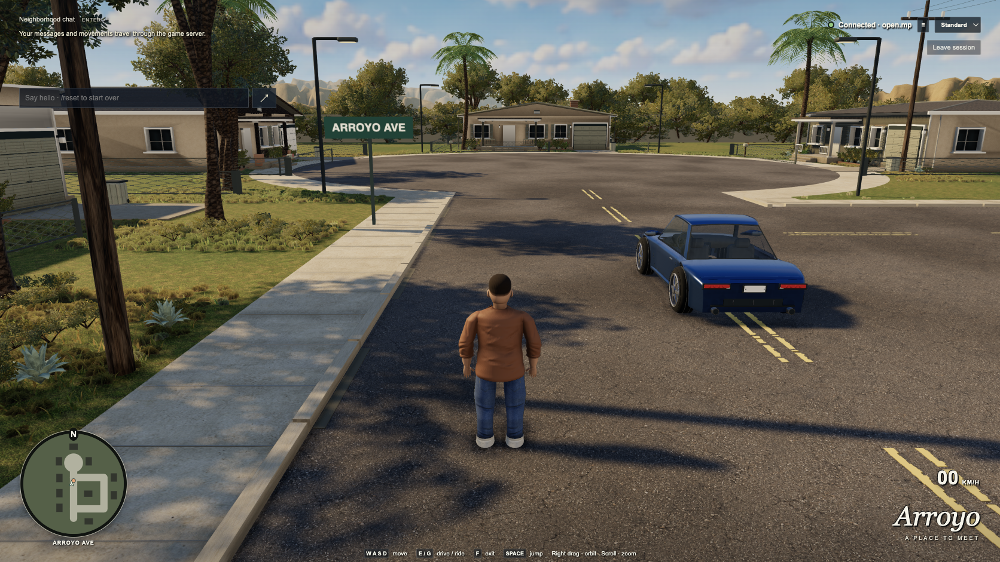

# Native Dream-loop results — September 13, 2026

Round twelve fixes the handoff's movement jitter and integrates new original
Blender foliage, clothing, planting and terrain work. The current native rendering
and full motion regressions pass. **The complete 15-scenario acceptance suite is
still pending a fresh pass**, and the visual target remains unfinished. The last
formal art review covers round eleven: **5.0/10, Tier 1**, against an 8/10 target.
No formal round-twelve score is claimed.

The tested game source is **`b49e186`**, scene **`6c1739ad64e66280`**. The served
module is `main-B6cZGs4C.js`, SHA256
`507908629ceba28a7194fa8c0eeb73695bcb44663b6bfe0e773a8886ad0ff2c5`.
The separately committed audit guard is `9b340a7`. Exact before/after source,
asset and served-build identities are retained in the linked verification files.

## Current appearance and authoring

This is an actual Chrome gameplay capture, rendered at 3344×1882 native pixels
and captured as a 1672×941 comparison image. Its [capture record](images/native-street-2026-09-13.json)
identifies the build and image hash. The [generated target](images/native-concept-2026-09-13.png)
is reference art, with a separate [origin record](images/native-concept-2026-09-13.json).

Native **Blender 5.2.1** rebuilt the ordinary and mature oaks, palm and neighbor.
The oaks have clearer crown openings and shaped leaf normals; the palm uses
individual drooping and twisted pinnae. The neighbor adds localized trouser
compression and distinct shoe heel, collar, sole and welt. The eleven-bone rig,
four animation streams, foot support, vehicle fit and original woody geometry
contracts remain. The model [integration record](native-model-integration-round12.json)
and [asset provenance](../assets/PROVENANCE.md) retain exact sources and exports.
Untouched models retain their earlier pinned provenance; no external game assets
or new texture service is required.

The three terrain meshes retain 172,800 triangles and all 218 perimeter placements.
A packed, connected gully mesh carries one baked diffuse-irradiance field, applied
once in both presets. Its editable native source matches the actual decoded
Float32 geometry. The [terrain record](native-terrain-integration-round12.json)
identifies complete native provenance. Ten road/sidewalk surfaces receive broad
pigment variation, and 57 added frontage shrubs bring that count to 141. Existing
plant transforms and sidewalk dirt remain exact; [ground checks](native-ground-integration-round12.json)
retain the details.

Three real Standard → Low → Standard cycles kept full native resolution and
reported no rendering errors. Repeated same-preset pixels were identical in four
static road, curb, terrain and lawn regions; see the [pixel comparisons](native-quality-cycle-round12.json).
This also verifies the material-isolation fix that prevents Low shading from
altering the restored Standard curbs.

The scene still differs visibly from the target in far-road shade distribution,
terrain detail, lawn variation and vehicle finish. The [last formal review](art-review-2026-09-13.md)
refers to this [older round-eleven frame](images/native-street-round11-2026-09-13.png).
Its 5.0 score must not be presented as a review of the new frame. A rear-house
canopy study is being evaluated separately; it is not part of the current build.

## Native rendering

Chrome **153.0.8010.37**, **ANGLE Metal on Apple M5 Pro**, native DPR 2. Each case
used a fresh context, five-second warmup, twenty-second idle sample and four-second
walk. The isolated audit completed at **10:53 UTC**.

| Preset / CSS viewport | Native drawing buffer | Idle / walking median FPS | p95 idle / walking | Logical texture storage |
| --- | --- | ---: | ---: | ---: |
| Standard, 1280×720 | 2560×1440 | 120.5 / 120.5 | 9.6 / 9.6 ms | 266.00 MiB |
| Low, 1280×720 | 2560×1440 | 120.5 / 120.5 | 9.7 / 9.8 ms | 119.34 MiB |
| Standard, 1672×941 | 3344×1882 | 120.5 / 120.5 | 9.7 / 9.6 ms | 315.72 MiB |
| Low, 1672×941 | 3344×1882 | 120.5 / 120.5 | 9.8 / 9.8 ms | 169.06 MiB |

Maximum sampled downloads were **46,575,188 bytes**, geometry **4,985,512 triangles**
and draw calls **912**. All unchanged 48 MB / 320 MiB / 6 million triangle /
1,000 call / 60 FPS gates pass. No browser errors or frame stalls over 50 ms
were recorded. These are short hardware-specific samples, not a promise of
constant 120 FPS on every route. Logical texture storage excludes driver overhead
and renderbuffers; maxima are sampled.

An earlier round-twelve measurement also passed 60 FPS but measured 61.35 FPS
at the largest Standard size. A separate owned, disconnected reference window
was then observed rendering 91 frames in 750 ms. The exact cause of its
reactivation was not established. The corrected audit explicitly freezes that
caller-selected page and proves its counter remains at 556,629 throughout each
warmup, idle and walking interval. It changes no resolution or quality setting.
The earlier result remains under `.dream-loop/native-render-audit/round-12/`;
the [full isolated audit](native-rendering-verification.json) and
[compact summary](native-rendering-summary.json) contain the accepted measurement.

## Movement and multiplayer

The current [full native motion proof](native-motion/README.md) passes on the same
scene. Local walking and driving both measured 120.5 FPS with **zero repeated
rendered positions**, while the deterministic 60 Hz simulation still repeated on
approximately half the display frames. Both jump/seat/exit cases produced zero
uncommanded height or upward velocity. Two-player remote motion retains some
network variation: three repeated positions in 322 frames and 15.36% speed
variation; zero remote stutter is not claimed.

Resetting an occupied car after 7.170 m of driving corrected the two clients in
176.8/185.2 ms. Local body and car presentation errors were zero; peer agreement
followed within 50.4/32.2 ms. Source, asset and served-resource hashes stayed exact,
both owned windows closed, and sessions/workers returned to zero. See
[motion results](motion-results.md) and the [summary](native-motion-summary.json).

The previous complete browser run remains **14 passed, 1 failed**: the final yard
soak hit an asynchronous observation deadline after 42 rounds. Saved browser
snapshots and all subsequent server vehicle observations showed the correct reset
position; the delayed runner did not establish command-to-correction timing.
A test-only observer now measures from the actual trusted reset Enter inside the
browser, freezes its verdict and rejects corrections observed after 1,000 ms or
at least 0.5 m away. Fresh correction counters and a separate fresh server sample
remain required. Negative controls and the focused real yard soak pass: 75 rounds over 605.2
seconds, 75 resets at most 267.7 ms, zero reset-position error and 150 ordinary
movement agreement samples within 0.483 m. Both recordings and clean worker
exits are preserved in the [focused summary](native-yard-soak/round12/summary.json).
A filtered pass cannot substitute for the pending full suite and its two
supervisor checks. See [acceptance environment](native-acceptance-environment.md).
