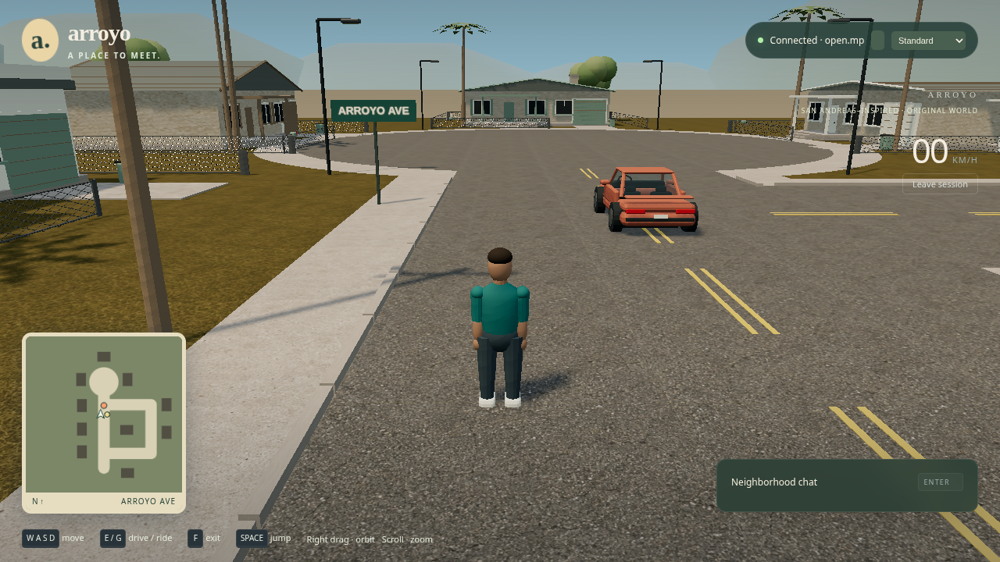
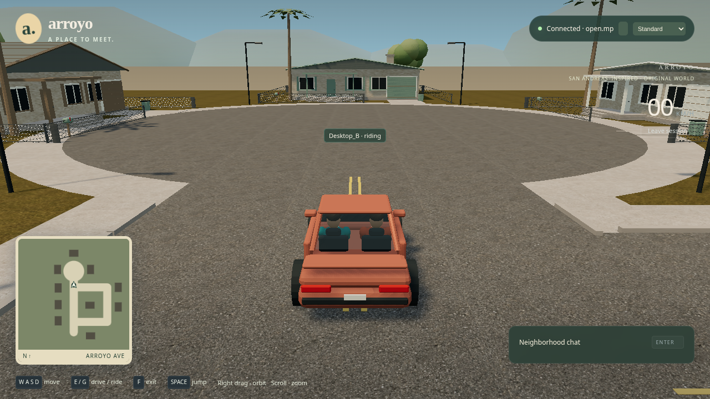

# Arroyo neighborhood results

Verified September 8, 2026. The neighborhood milestone is implemented and its local acceptance gates pass. Scene revision: `eb61086b5bfd46f6`. Implementation commit: `b9093d8`; the [machine result record](neighborhood-verification.json) contains exact SHA256 hashes of the tested source, asset inventory and native worker.

## Delivered

Arroyo is an original 180 × 180 meter neighborhood with a cul-de-sac and connected driving loop, ten houses from four architectural kits, porches/garages/driveways, fenced yards, palms and broadleaf trees, mailboxes/bins, utility poles with sagging wires, streetlights, road markings, sidewalks and a closed boundary. Weathered materials, blue sky, afternoon lighting and restrained haze accompany the original rigged neighbor in teal/rust outfits and a two-seat sports coupe. Idle, walk, jump and seated animations derive from replicated state; both occupants remain visible inside the cabin.

Presentation is split into asset loading, environment, spatial collision, characters, camera and HUD modules. Camera-relative walking, right-drag orbit, wheel zoom and the driving camera preserve the original controls and correction lifecycle. The minimap, speed/status display, collapsible chat, loading/retry UI and debug toggle are integrated. Join waits for verified assets and collision data; scene mismatches are rejected before worker admission.

The unchanged open.mp v1.5.8.3079 release and one native worker per browser still carry all peer gameplay. `POC_SCENE=yard` retains the original regression fixture. The shared manifest supplies placements, colliders, minimap paths and Pawn coordinates; its revision includes the asset inventory.

## Acceptance evidence

`npm run verify:poc` completed **14/14 headed browser scenarios**, plus TypeScript checking, production build, **3 gateway tests, 6 scene tests, 3 native CTests**, and **2 supervisor shutdown probes**. There were zero uncaught page errors in the multiplayer sessions.

| Gate | Final evidence |
| --- | --- |
| Original yard regressions | Normal admission, walking/chat/driving, contention, swap, correction, duplicate nickname, crash, unavailable/restarted server, hidden-tab cleanup and safe exit passed |
| Neighborhood loading and geometry | Missing-asset retry, mismatched revision, clear spawns, house/fence/trunk collision, safe exits, obstruction-limited camera, four clips and measured occupant/cabin bounds passed |
| Complete neighborhood loop | Both role assignments visited all nine feedback-controlled waypoints using ordinary keyboard input; independent server vehicle observations recorded |
| Neighborhood active soak | 92 walking/chat/driving rounds over 603.097 seconds |
| Retained yard active soak | 78 rounds over 602.448 seconds |
| Reconnects | 20 neighborhood context closures, 20 same-tab neighborhood rejoins, and 20 yard cycles; server slots and workers released; skeleton texture counts remained bounded |
| Settled neighborhood agreement | 200 checks; maximum browser/server distance 0.0737, maximum browser/received-peer distance 0.0263 world units; required <0.5 within one second |
| Actual desktop | `npm run verify:desktop`: two normal players, chat, walking, both occupants, driving, exits and worker cleanup on display `:1` using Google Chrome 152.0.7977.82 |

The desktop backend reported `ANGLE (Google, Vulkan 1.3.0 (SwiftShader Device (Subzero) (0x0000C0DE)), SwiftShader driver)`. The full automated suite used Google Chrome for Testing 147.0.7727.15 under Xvfb, Node v24.14.0, Linux x86_64. These are software-rendering results.

## Graphics and download budgets

| Measurement | Observed | Initial cap/target |
| --- | --- | --- |
| Downloaded models and atlas | 4.41 MB across 15 files | Included in scene budget |
| Complete cold scene load, including code/UI/metadata | 5.09 MB | 15 MB |
| Low submitted triangles / calls | 50,550 / 74 | 300,000 / 250 |
| Standard submitted triangles / calls, desktop views | 143,868 / 125 | 300,000 / 250 |
| Logical texture storage, cold Low | 5.70 MiB | 96 MiB |
| Logical texture storage after Standard/Low switching | 13.70 MiB | 96 MiB |
| Two Low views, median FPS | 20.0 / 20.0 | >=20 |
| Two Low views, p95 frame time | 66.6 / 66.7 ms | <100 ms |

Both benchmark viewports were **1280 × 720**, with Low rendering the 3D scene at **384 × 216** (30% per dimension); the HTML HUD stays at display resolution. Low uses baked vertex shading, simplified fence wires and contact shadows. Standard renders at full resolution on this display with PBR and soft shadow maps. It is visibly sharper but slower on SwiftShader.

Ordinary-play performance used a ten-second warm-up followed by 30.4 seconds of active two-player play with video/tracing disabled; metrics use the last 300 frame intervals. FPS is reported to 0.1 FPS and raw median frame times are retained. The separate recorded soak retained traces/video and measured 15.0 / 15.0 FPS with 83.3 / 83.3 ms p95. Capture overhead is reported separately, not hidden in the ordinary-play result.

Texture storage is audited from WebGL uploads, immutable storage, mipmaps and deletes, including skeleton/shadow textures, with no unaccounted formats in these runs. It measures logical allocation bytes rather than physical VRAM, driver overhead or total browser memory. Render counts include submitted shadow work where enabled. These sampled budgets do not establish hardware GPU performance or a guarantee for every future camera/asset combination.

## Editable assets and reproduction

Run `npm run setup:poc`, then `npm run dev:poc` and `npm run open:poc`. Use the Low preset on this cloud desktop. Stop the demo before `npm run verify:poc`; allow approximately thirty minutes and close extra software-rendered game windows. With the demo running and no other players, `npm run verify:desktop` repeats the actual desktop check. `POC_SCENE=yard npm run dev:poc` selects the retained yard.

`npm run build:assets` uses checksum-pinned Blender 4.5.13 and committed texture inputs. The authoritative modeling/rigging/export recipe is `tools/assets/build.py`; editable `.blend` files and optimized GLBs are committed. `node tools/create-scenes.mjs` regenerates the committed layouts. Ordinary setup does not install Blender or invoke image generation. See [asset provenance](../assets/PROVENANCE.md) for source hashes, original imagegen prompts and licensing; the imagegen skill and its Apache license are included in `.agents/skills/imagegen`.

Detailed evidence stays ignored in [artifacts/neighborhood](../artifacts/neighborhood/), [artifacts/verification](../artifacts/verification/) and [artifacts/desktop](../artifacts/desktop/): server observations, decoded agreement samples, worker transitions, routes, errors, screenshots, traces and videos. The JSON record and selected original game screenshots are committed; large recordings must be reproduced in a fresh workspace.

## Experiments and remaining limits

The primary Blender download endpoint returned a Cloudflare challenge; the official mirror supplied the checksum-pinned archive. Early cloud rendering missed the frame target, leading to material/geometry batching and an explicit Low resolution tradeoff. Visual review corrected a covered join button, competing camera updates, heads clipping the roof, road furniture inside the turning circle and missing decorative trunk colliders. Actual desktop verification exposed an obsolete packet-handler visibility flag for seated peers; it was removed. Repeated joins now dispose skeleton textures. An earlier full 14-scenario pass was preserved before the final placement changes; the result above belongs to the final revision.

Original GTA clients, stock SA-MP servers, public servers, non-Chromium browsers, hardware GPU performance and WAN behavior remain unverified. Arroyo's custom geography does not align with the original GTA world. The scene is outdoors and flat, with approximate arcade collision/handling and no interiors, traffic, ambient pedestrians, combat or day/night cycle.

The next implementation slices are a **server-scored checkpoint challenge**, **private HTTPS/WSS invitations with limits and latency tests**, then a **native GTA/SA-MP comparison fixture**. Their concrete first steps and gates are in the [roadmap](roadmap.md#next-implementation-slices-after-arroyo).
