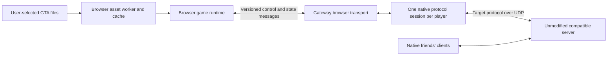

# Browser runtime and SanAndreasUnity research

Research date: **2026-09-07**. Scope: source inspection and primary documentation; no game, WebGL build, gateway, or interoperability experiment was executed. Statements marked **proposal** or **inference** are engineering judgments, not demonstrated compatibility.

## Findings that apply to either protocol

An ordinary browser page cannot send raw UDP to an existing SA-MP or MTA server. Compiling a native networking library to WebAssembly does not remove this restriction. Emscripten documents WebRTC and WebTransport as alternatives and a WebSocket-to-POSIX proxy that performs TCP/UDP operations outside the browser; its general socket proxy is principally for testing/debugging and can be slow. **Inference:** browser-native play needs a gateway, or a modified game server offering a browser transport. A gateway preserves the option of an unmodified upstream server. [Emscripten networking](https://emscripten.org/docs/porting/networking.html)

Protocol compatibility and game-engine compatibility are separate workstreams. A correct join packet cannot supply terrain, collision, animation, camera behavior, vehicle handling, weapons, or UI. A working renderer cannot establish multiplayer interoperability. Plan early demonstrations that prove both sides incrementally.

## SanAndreasUnity: useful reference, unproven browser foundation

Inspected repository: [in0finite/SanAndreasUnity](https://github.com/in0finite/SanAndreasUnity), branch `dev`, commit [`f685c437f48721afc0787f27d22c85d96e8684c7`](https://github.com/in0finite/SanAndreasUnity/commit/f685c437f48721afc0787f27d22c85d96e8684c7), dated 2022-09-30. Local shallow checkout: `.context/research/unity`. Submodules were identified but not recursively installed or audited.

| Question | Verified evidence | Consequence |
| --- | --- | --- |
| Complete GTA engine? | The README explicitly limits its ambitions to a partial engine recreation, gameplay, multiplayer, and extensibility. It lists tested Linux, Windows, Mac, and Android platforms and requires the user's GTA installation. [Pinned README](https://github.com/in0finite/SanAndreasUnity/blob/f685c437f48721afc0787f27d22c85d96e8684c7/README.md) | Treat feature demonstrations as examples, not GTA behavioral parity or a verified WebGL release. |
| Existing SA-MP/MTA support? | `.gitmodules` pins MirrorLite; `NetManager` selects Telepathy/KCP transports; `PedSync` sends Mirror commands and `VehicleController` uses Mirror sync variables. [Submodules](https://github.com/in0finite/SanAndreasUnity/blob/f685c437f48721afc0787f27d22c85d96e8684c7/.gitmodules), [NetManager](https://github.com/in0finite/SanAndreasUnity/blob/f685c437f48721afc0787f27d22c85d96e8684c7/Assets/Scripts/Networking/NetManager.cs), [PedSync](https://github.com/in0finite/SanAndreasUnity/blob/f685c437f48721afc0787f27d22c85d96e8684c7/Assets/Scripts/Networking/PedSync.cs), [VehicleController](https://github.com/in0finite/SanAndreasUnity/blob/f685c437f48721afc0787f27d22c85d96e8684c7/Assets/Scripts/Behaviours/Vehicles/VehicleController.cs) | Its multiplayer is its own protocol. Substituting a transport would not turn its gameplay messages into SA-MP or MTA messages. |
| What can be reused? | Archive abstractions read the GTA `models`/`data` directories; source includes RenderWare readers and vehicle/ped systems. [ArchiveManager](https://github.com/in0finite/SanAndreasUnity/blob/f685c437f48721afc0787f27d22c85d96e8684c7/Assets/Scripts/Importing/Archive/ArchiveManager.cs), [RenderWare readers](https://github.com/in0finite/SanAndreasUnity/tree/f685c437f48721afc0787f27d22c85d96e8684c7/Assets/Scripts/Importing/RenderWareStream) | Candidate asset-format reference and behavioral prototype. Reuse needs correctness fixtures and dependency review. |
| Which Unity version? | `ProjectVersion.txt` pins `2020.3.26f1`. [Project version](https://github.com/in0finite/SanAndreasUnity/blob/f685c437f48721afc0787f27d22c85d96e8684c7/ProjectSettings/ProjectVersion.txt) | A current Unity port entails an upgrade evaluation as well as browser adaptation. |
| License? | Root project license is MIT, requiring preservation of its notice. [Pinned license](https://github.com/in0finite/SanAndreasUnity/blob/f685c437f48721afc0787f27d22c85d96e8684c7/LICENSE) | The root license is evidence about this software, not permission to distribute GTA content or proof that all dependency licenses match. |

The WebGL issue was closed, but that does **not** establish a working port. In the [maintainer's 2024-07-15 comment](https://github.com/in0finite/SanAndreasUnity/issues/150#issuecomment-2228334933), retrieved through GitHub's issue-comments API, the maintainer described browser execution as possible with manual game-folder selection and significant file-loading changes. No working WebGL artifact was established in this research. The [open interior issue](https://github.com/in0finite/SanAndreasUnity/issues/60) also documents outstanding collision/visibility edge cases; neither issue is an exhaustive feature inventory.

Three concrete adaptation points are visible in source:

1. `LoadingThread` starts a managed background job runner; pathfinding also starts background work. Unity 2020.3 documents unsupported managed threads on WebGL. Unity 6.0 still documents no C# threading, despite optional native C/C++ threading. A Unity upgrade alone is therefore insufficient. [LoadingThread](https://github.com/in0finite/SanAndreasUnity/blob/f685c437f48721afc0787f27d22c85d96e8684c7/Assets/Scripts/Importing/LoadingThread.cs), [PathfindingManager](https://github.com/in0finite/SanAndreasUnity/blob/f685c437f48721afc0787f27d22c85d96e8684c7/Assets/Scripts/Behaviours/PathfindingManager.cs), [Unity 2020.3 limitations](https://docs.unity3d.com/2020.3/Documentation/Manual/webgl-technical-overview.html), [Unity 6.0 limitations](https://docs.unity3d.com/6000.0/Documentation/Manual/webgl-technical-overview.html)
2. Direct path-based file/archive/audio access needs a browser storage adapter. A browser-selected file is not automatically a native path. The maintainer's shorthand about `File` should not be read as saying all virtual-filesystem use is impossible.
3. `PluginManager` discovers local DLLs and calls `Assembly.LoadFrom`. **Inference:** this desktop plugin model should be excluded from a first WebAssembly client; the browser build needs a separately defined supported extension model. [PluginManager](https://github.com/in0finite/SanAndreasUnity/blob/f685c437f48721afc0787f27d22c85d96e8684c7/Assets/Scripts/Behaviours/PluginManager.cs)

**Recommendation:** use SanAndreasUnity as a reference and a time-boxed engine candidate. Do not commit the project to it before a small scene loads from user-selected files and runs within measured browser budgets. Its own multiplayer architecture would need replacement or substantial isolation.

## Transport choices and gateway placement

| Browser transport | Established capability | Proposed role and tradeoff |
| --- | --- | --- |
| Secure WebSocket | Bidirectional messages to a WebSocket endpoint; no raw socket access. [WHATWG standard](https://websockets.spec.whatwg.org/) | Simplest first query/join/chat/debug transport. Its reliable ordered delivery means old traffic can delay newer movement; use bounded queues and measure under loss before claiming gameplay quality. |
| WebRTC DataChannel | SCTP over DTLS, normally over UDP; reliable/partially reliable and ordered/unordered modes. [RFC 8831](https://www.rfc-editor.org/rfc/rfc8831.html) | Strong candidate for interactive play: reliable control channel plus unordered movement channel with `maxRetransmits: 0`. Requires signaling, ICE and a compatible gateway peer; account for relay deployments. |
| WebTransport | Streams and datagrams through a WebTransport endpoint. The specification distinguishes HTTP/3's unreliable capability from HTTP/2's reliable-only mode. [W3C specification](https://www.w3.org/TR/webtransport/) | Attractive browser-to-gateway design; measure actual target-browser/network support and negotiated reliability. It cannot speak directly to a legacy UDP server. Respect negotiated datagram size. |

WebRTC options default to ordered delivery; unreliable behavior must be chosen explicitly. Channel configuration does not supply game-level sequencing, entity versions, or safe handling of stale state. [W3C data-channel API](https://www.w3.org/TR/webrtc/#dom-rtcdatachannelinit)

**Proposed initial architecture:**

Terminate the legacy transport's reliability/handshake machinery in the gateway initially; expose explicit typed state and commands to the browser. This makes native networking debugging independent of rendering and avoids a premature WebAssembly port of the legacy transport. The browser still owns its playable simulation/rendering, while the gateway translates the selected protocol and maintains each player's upstream session. Whether this is sufficient for a target server's client checks remains a protocol-specific experiment.

Keep the adapter's wire decoder separable from its typed browser contract so packet fixtures can exercise both. Do not discard unknown RPCs silently: surface them in a compatibility report and decide whether they make a session unsupported.

An alternative is a transparent datagram gateway with the full legacy protocol running in browser/Wasm. That preserves more client logic locally but adds transport porting, timer/background-tab, datagram-size and nested-reliability concerns. It is a later experiment if the native-session approach proves undesirable. A transparent relay must preserve datagram boundaries; mapping raw legacy datagrams onto a reliable ordered tunnel changes latency behavior even if their bytes are unchanged.

These are design recommendations, not results from benchmarks. No transport has been selected on the basis of measured performance yet.

## Assets, storage, rendering, and physics

**Proposed asset policy:** initial synthetic test geometry; later explicit, local selection of the user's supported PC GTA installation. Publish application code and original fixtures; do not bundle proprietary game files as an assumed convenience. Record accepted file variants and required files in a versioned manifest. The user's ownership and redistribution permissions are distinct questions; this report establishes no redistribution rights.

`showDirectoryPicker()` provides user-selected directory access where supported; permissions may need renewal. It cannot silently read a friend's game folder or access arbitrary machine paths. Provide a file-selection fallback and check the actual browser matrix. [Chrome File System Access documentation](https://developer.chrome.com/docs/capabilities/web-apis/file-system-access)

**Proposed pipeline:** enumerate files and index archives, read only necessary byte ranges, parse/decode in workers, cache versioned derived chunks, and stream a bounded neighborhood into the renderer. Keep source files local by default. Explicitly measure copies between JavaScript, Wasm, and GPU; file size is not runtime memory cost. Avoid loading the complete installation into a Wasm virtual filesystem.

The origin-private filesystem provides storage isolated to an origin, and synchronous access handles are available in dedicated workers for efficient access. Treat it as an optional cache that can be absent or lost, not the only surviving copy of game files. [WHATWG File System standard](https://fs.spec.whatwg.org/)

Unity's memory documentation describes Wasm heap allocation, browser memory pressure, and additional data/assets held during execution. **Proposal:** benchmark cold import, warm import, peak memory, GPU memory where measurable, frame-time distribution, and streaming stalls before expanding from a neighborhood to the full map. Set budgets on named test hardware after the first measurements, not from native screenshots or the size of GTA's original install. [Unity web memory](https://docs.unity3d.com/6000.0/Documentation/Manual/webgl-memory.html)

**Inference:** playable compatibility requires a behavioral contract with the native client, even where exact physics parity is unnecessary. Compare collision shapes, coordinate/quaternion conventions, animation and player states, velocities, seat transitions, vehicle ownership, health, weapon behavior, and server corrections. An attractive car controller that produces incompatible state is not progress toward playing together.

Cloud streaming is a separate product option: a native GTA/multiplayer client runs on another machine and sends video/audio while browser input returns remotely. It can avoid browser engine recreation, but requires per-session compute, encode/decode latency and a permitted GTA/client installation there. It does not implement either legacy protocol in the browser. Keep it as an explicit fallback if the objective changes to browser access to a remotely running game.

## Experiments and stop conditions

| Order | Experiment | Evidence required to continue |
| --- | --- | --- |
| 1 | Native minimal protocol client against a pinned, controlled server | Repeatable query, join, initialization, chat, spawn and disconnect logs; a native friend sees the client. This is a separate prerequisite from browser graphics. |
| 2 | Browser through gateway using synthetic geometry | One browser and one native client see each other's movement and chat for a sustained session; each browser has an independent upstream identity; cleanup releases sessions. |
| 3, parallel with 1–2 | Small engine/asset spike: SanAndreasUnity adaptation versus a deliberately minimal browser-native scene | Same legally supplied small asset subset, textured mesh, collision, animation, frame time, memory, load time and estimated adaptation effort. Choose engine only after comparing this evidence. |
| 4 | Transport impairment matrix | Compare WebSocket and selected datagram transport under added RTT, jitter, loss, bandwidth limits, reconnects and tab suspension. Record queue growth, stale-state age, native-client observations and session cleanup. |
| 5 | Small drivable neighborhood | Browser player can walk, enter a vehicle, drive, exit and reconnect alongside native friends; no persistent correction loops or entity/seat divergence. |
| 6 | Scale and compatibility expansion | Named browser/device and server/version matrix, streamed neighborhoods, more server RPCs, UI, combat and edge cases. Unsupported features are explicit. |

Stop expanding graphics if join/authentication cannot be implemented from acceptable sources. Stop treating an engine as selected if its browser build needs unbounded rewrites or cannot fit the measured budget. Revisit the product scope if interoperability requires native-only checks that cannot be satisfied through a supported path. Do not equate these proposed gates with completed tests.

## Open questions for the implementation phase

- Which exact server/client versions and gamemode define the first supported protocol profile?
- How much client validation and game behavior must the gateway reproduce for that profile?
- What is the smallest supported asset edition/subset, and which model/texture/collision variants occur in it?
- Can an isolated SanAndreasUnity renderer/controller be adapted faster than a minimal browser-native runtime once its Mirror coupling and managed threads are removed?
- Which browsers/devices, network restrictions and latency targets matter for the friends' actual sessions?
- What gateway resource cost and shared-source-IP behavior result from one native session per browser?

Record experiment commands, pinned revisions, captures, metrics, observed failures and changed decisions in the project documentation when work resumes. The local research clone is disposable; the evidence links and revision identifiers above are the durable record.
