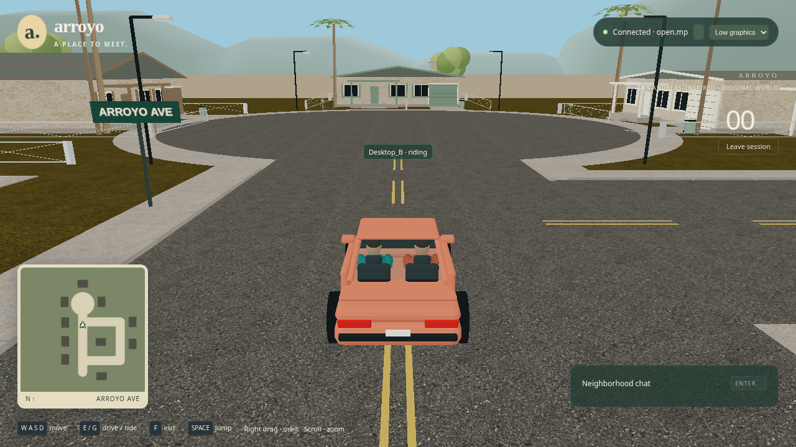

# Full-resolution rendering correction

Updated September 8, 2026, following the user's instructions. Both Low and Standard render at the full viewport dimensions multiplied by the display's native device pixel ratio. The old 30% Low scale and 1.5× Standard pixel-density cap are removed. Resize, preset changes and reload preserve full resolution. No automatic resolution reduction is permitted to meet performance targets.

The user revised the cloud software-rendering target to **4 FPS per view**. P95 frame time remains reported; the former 100 ms cap is retired because a 4 FPS median corresponds to a 250 ms frame. Hardware GPU performance must be measured separately; these cloud numbers are functional smoke-test measurements.

## Verification

- TypeScript checking and the production build passed.
- All four headed graphics scenarios passed: native rendering, both presets at 1×/2× device pixel density across resize/reload, disabled-WebGL recovery, and context exception/retry.
- Actual cloud desktop verification passed: two normal players, chat, walking, visible occupants, driving, exits and worker cleanup. Both presets used 1280×720 drawing buffers at a 1280×720, 1× viewport.
- The unrecorded two-view cloud benchmark completed 11 active driving/reset/role rounds after warm-up, including independent server/peer agreement checks. It measured **5.0 / 4.6 FPS median**, with **266.6 / 250.1 ms p95** at full 1280×720 resolution. These recorded values satisfy the user's revised 4 FPS target. The original run failed its then-current 5 FPS assertion; that historical result remains preserved. The threshold update was verified by re-evaluating the saved metrics, without a fresh browser benchmark or rendering change.
- The earlier full multiplayer/ten-minute soak results remain historical. The complete soak suite was not rerun for this rendering-only correction. Hardware GPU performance remains unverified.



Exact measurements, tested source hashes and artifact paths are in [the verification record](resolution-verification.json). The earlier [neighborhood result record](neighborhood-results.md) explicitly identifies its reduced-resolution measurements as historical.

## Reproduce focused checks

Stop the demo and close extra software-rendered game windows first:

```sh
npm run typecheck
npm run build:browser
POC_NEIGHBORHOOD_ARTIFACTS=artifacts/resolution/neighborhood xvfb-run -a --server-args='-screen 0 1600x1000x24' npx playwright test --grep 'graphics:|two full-resolution' --reporter=list --output=artifacts/resolution/browser
```

The benchmark still enforces >=4 FPS, full native resolution and asset/geometry/texture budgets. A missed FPS target fails the test without reducing rendering quality. The full summary now expects 15 browser scenarios, including the added native-resolution regression.

For actual desktop verification, start `npm run dev:poc`, then run `POC_DESKTOP_ARTIFACTS=artifacts/resolution/desktop npm run verify:desktop`. Use `npm run open:poc` to open the interactive demo. Separate artifact directories preserve the earlier acceptance evidence.
