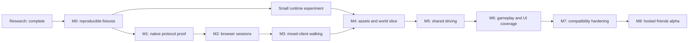

# Development roadmap

Date: 2026-09-07. This research roadmap is retained as historical context. The narrower browser/open.mp PoC is implemented; the current accepted milestone is [Arroyo neighborhood](neighborhood-plan.md), followed by a shared checkpoint challenge, private remote invitations/latency tests, and native-client interoperability. Consult [project status](status.md) for measured results rather than treating the original gates below as current status.

## Product target and dependency order

First playable result: a desktop browser user opens the game, selects an available server, supplies supported local assets if needed, spawns beside a native SA-MP friend, chats, walks, enters the same supported vehicle as driver/passenger, and completes a short drive. Start with 2 players; expand to an 8-player private session. No native helper should be required on the browser user's machine.

The controlled-server assumption lets us deliberately select supported features. It does not remove the requirement to speak the ordinary upstream protocol. Graphics alone, query replies, an NPC bridge, and browser-to-browser multiplayer on a new backend are not acceptance substitutes.

Keep the runtime experiment small while M1 is unresolved. Network feasibility and engine feasibility can be investigated independently, but a complete engine build should wait for evidence.

## M0 — Establish the reproducible lab

1. Pin open.mp v1.5.8.3079, its release artifact SHA-256 and dependency revisions recorded in [SA-MP research](research/sa-mp.md). Record OS/compiler versions and distribution/runtime requirements. Use an isolated server recipe; detect whether containers are available and supply a direct Linux path if necessary.
2. Generate config using that executable. Configure a non-announced server allowing 0.3.7, without optional artwork or required client extensions. Run a minimal Pawn gamemode with one spawn class, a flat known test area, one vehicle, chat and logging for connect/spawn/state changes.
3. Inventory the native test installation and exact SA-MP client build. A native reference run requires a supported user-owned GTA installation and a test player; no such installation has been verified in this workspace. Server-only tests can start before it is available, but native comparison remains a dependency.
4. Record source/license terms per reused file/library. Prefer independently published open.mp code and normal observations. Do not use FlexodMR as a code donor without resolving its provenance and permissions. Decide whether to use the older RakNet code under an applicable license or implement an independent transport; document that choice in a new ADR before vendoring.
5. Create a compatibility ledger with `planned`, `implemented`, `fixture-tested`, `openmp-tested`, `stock-samp-tested`, `unsupported` columns; attach exact binaries/configurations to every result. Create capture/replay tools and sanitized fixture format.

**Exit:** reproducible server start/stop, native player baseline where available, an identified dependency path for M1, and a written fixture manifest. Do not mark native validation complete based on source inspection.

## M1 — Prove a native replacement protocol client

1. Make a small headless C++ protocol process. Log state transitions, IDs, delivery metadata and failure reasons without logging secrets. Start with UDP query only to verify connectivity; label this explicitly as discovery.
2. Implement the client side of RakNet/SA-MP negotiation, directional datagram transformation, cookie/auth exchange, connection acceptance and `PlayerConnect`. Derive exact behavior from pinned server source and independent observations. Do not simply compile `RakClient` and assume it works.
3. Decode initialization and pool lifecycle; perform class request, spawn request/response, spawn notification and chat. Implement both directions separately where encodings differ. Add keepalive, timeout, rejection and clean disconnect handling.
4. Send valid idle on-foot sync and respond to required state changes. Prove that the server treats the process as a regular human-player connection, not an NPC or bypassed session. Observe it from a normal native client.
5. Save independent golden cases for handshake, reliable control and on-foot sync; test truncation, malformed lengths, replayed/stale packets and invalid numeric state. Compare against actual observations, not only encode/decode round trips.
6. Repeat the minimal join/spawn/chat/idle scenario against a pinned original SA-MP 0.3.7 server artifact where legitimately available. Record differences. If this fixture is unavailable, retain a clearly limited open.mp result and keep original SA-MP compatibility pending.

**Exit:** join → initialization → class selection → spawn → chat → 10 minutes of accepted idle sync → clean disconnect; native observer sees the player. Repeat 20 sequential joins without leaked slots/sockets. Record which steps pass on each server family.

**Gate:** time-box the first admission investigation to roughly 5 focused engineering days, then review concrete failures. This is a review interval, not an estimate that the protocol can be completed in a week. If blocked, isolate transport versus authentication versus RPC failure and choose the next experiment before doing broader engine work.

## M2 — Connect an actual browser through the gateway

1. Wrap the native worker in a session service with configured target server IDs, one upstream session per browser and explicit cleanup.
2. Define versioned browser control/events and snapshot schemas. Build a browser page for connect/disconnect, state, player list and chat using secure WebSocket.
3. Test two independent browser sessions concurrently beside the native reference player. Verify routing, unique player slots, passwords, rejection reporting and gateway-IP limits. No GTA renderer is required yet.
4. Add browser lifecycle handling: reload, dropped connection, background tab, server restart and worker crash. Use fresh session epochs; discard old state.
5. Add WebRTC transport and basic signaling/TURN support. Preserve reliable control ordering while discarding obsolete movement snapshots. Use control revisions or readiness barriers across channels; explicitly test movement overtaking spawn, teleport and seat-change events. Benchmark WebSocket against WebRTC with the same workload before selecting fallback behavior.

**Exit:** two browsers can independently join/spawn/chat through the ordinary server protocol; no cross-session messages or zombie players. Demonstrate the transport path in at least two desktop browser engines; record versions and network conditions.

## Small runtime experiment — Choose an engine with evidence

In parallel with the early protocol work, time-box a 3–5 engineering-day comparison. Build a small browser scene using original placeholder assets, camera/input, one collision surface and animated/placeholder player. Assess a minimal TypeScript/WebGL runtime against the amount of SanAndreasUnity code worth adapting; do not assume that producing a full Unity WebGL build fits the time-box.

Measure frame time, memory, initial load, input responsiveness, file import strategy, licensing/dependency surface and engineering work remaining. Where supported local data is available, try one mesh/texture/collision import. If it is unavailable, record that limitation and use synthetic fixtures. Record the choice in ADR 0002, with clear separation between measured and estimated properties. Keep the choice provisional until real user-selected asset ranges import and stream within measured browser memory/frame budgets; synthetic scenes do not validate filesystem, threading or Wasm-copy costs. A successful scene is an engine experiment, not multiplayer evidence.

## M3 — Mixed-client on-foot play

1. Connect the browser runtime to real gateway player lifecycle, position, heading, health and animation state. Start with placeholder geometry at coordinates matching the native test area.
2. Implement bounded fixed-step walking/jumping and ground collision, server teleport/spawn correction and remote interpolation. Translate coordinate/quaternion conventions explicitly.
3. Honor stream-in/out, death/respawn, player ID reuse and local camera/control changes. Handle unknown messages with observability and stop safely when an unsupported message changes essential state.
4. Test browser → native and native → browser motion, including turns, jumps, teleports, tab suspension and reconnect. Record packet observations and videos for both viewpoints.

**Exit:** a browser and native friend walk and chat together for 15 minutes, with no persistent position divergence, stuck spawn states or stale entities. Use controlled latency/loss profiles and document observed error; do not call it GTA physics parity.

## M4 — Load a real world slice and stream assets

1. Select and document one supported original GTA data variant. Validate the imported files and explain missing/incompatible data. Provide selection via browser file APIs and a cache reset path.
2. Build small synthetic parser fixtures, then incremental IMG/IDE/IPL/DFF/TXD/COL support as required for the chosen area. Add animation/skin import, LOD selection and worker-based parsing where measured useful.
3. Load only the needed world cells, collision and current player/vehicle assets. Bound CPU/GPU caches, validate parser inputs, and recover from quota limits or incomplete imports. Keep source data local by default.
4. Match native coordinates, surface height/collision and essential spawn/vehicle assets in the area. Check SA-MP-specific added models separately; a base GTA import is not automatically all 0.3.7 content.

**Exit:** reloadable browser world slice with one player skin and one vehicle, correct ground/collision relative to the native client, cache versioning and measured load/memory/frame-time budgets on the chosen baseline device. Record the asset variant and every unsupported feature.

## M5 — Drive with native friends

1. Implement vehicle spawn/streaming and driver/passenger entry/exit RPCs, seat ownership, transitions and network state.
2. Support one ordinary four-wheel car first. Reproduce enough acceleration, braking, steering, suspension and collision behavior for the chosen route. Honor server position/health/vehicle commands and native driver updates.
3. Add vehicle health/damage/respawn, unoccupied updates needed for this scenario, ownership transfer and disconnect recovery. Treat remote vehicles as interpolated state according to ownership; do not run competing authoritative simulations.
4. Test all combinations: browser driver/native passenger, native driver/browser passenger and two browser players. Include rapid seat changes, stream boundaries, packet loss and driver disconnect.

**Exit:** complete the same short route from both driver roles, with correct seating and no persistent ownership or position divergence. This is the earliest intended **friends freeroam MVP**. Boats, bikes, aircraft, trailers and special vehicle behavior remain separate work.

## M6 — Expand gameplay and UI compatibility

Prioritize using traces from selected gamemodes. Add dialogs and responses, textdraws/clicks, scoreboard, checkpoints, map icons, pickups, objects/materials, animation commands, interiors/world changes, camera effects and required audio. Add aiming, weapons, bullet/damage/death semantics and test the server's lag-compensation behavior before claiming combat support. Finish each feature vertically: wire layout → runtime behavior → native comparison → compatibility ledger.

**Exit:** a named freeroam gamemode and one representative scripted interaction flow work from browser and native clients. Unsupported required features are visible and reproducible. Implementing many RPC IDs without their effects is not compatibility.

## M7 — Compatibility, resilience and performance

1. Run the accumulated suite on pinned open.mp and original SA-MP fixtures. Add other server configurations individually. Refresh fixtures deliberately rather than silently adopting newer dependencies.
2. Exercise server/client sync rates, packet fragmentation, password/admission failures, long sessions, entity ID reuse and scripted client checks. Servers requiring an unsupported native integrity/custom-client mechanism remain unsupported; do not report fabricated successful checks.
3. Measure a test matrix: LAN, 50/100/200 ms RTT, 0/1/3% loss and 0/20 ms added jitter, applied to each leg separately and together. Measure native-to-native baseline in the same setup.
4. Test 8 simultaneous sessions, then optional 16-session capacity. Track CPU/RAM/bandwidth per worker, browser frame time, snapshot age, disconnect rates and TURN costs. Set capacity from results.
5. Run decoder fuzzing and lifecycle stress where they exercise meaningful parser/state risks. Verify gateway destination restrictions, limits, crash isolation and sanitized logs.

**Initial performance objectives:** at least 30 FPS in the supported slice on a documented integrated-GPU baseline, bounded queues, and no unrecovered gameplay state corruption in a 30-minute 8-player session. Define acceptable positional error and p95 snapshot age from M3/M5 native comparisons. Do not impose invented universal GTA tolerances before measuring the baseline.

## M8 — Hosted friends alpha

Package the web app, gateway and test server recipe; host gateway UDP/WebRTC services on infrastructure that supports them. Configure HTTPS, certificates, session access, TURN and observability. Static hosting alone cannot run the native upstream connection. Add an invite/server selection flow, asset import progress, connection errors and explicit supported-server/features information.

**Exit:** friends on separate networks can open a link, prepare assets, join native players, and complete the supported walking/driving session without developer tools. Record the full reproducible setup and operating cost for the measured group size. Broader public-server support, mobile, complete San Andreas gameplay and MTA support require new scope decisions.

## Execution discipline

Ship small vertical slices and retain replayable evidence. At the end of each work session update [status](status.md) with changes, exact commands/environment, passed and failed tests, artifacts and the next task. Add an ADR when changing protocol, transport termination, engine or compatibility scope. Keep estimates conditional until the admission and runtime experiments have measured the major unknowns; this is a substantial engine/client project, not a weekend packet proxy.
