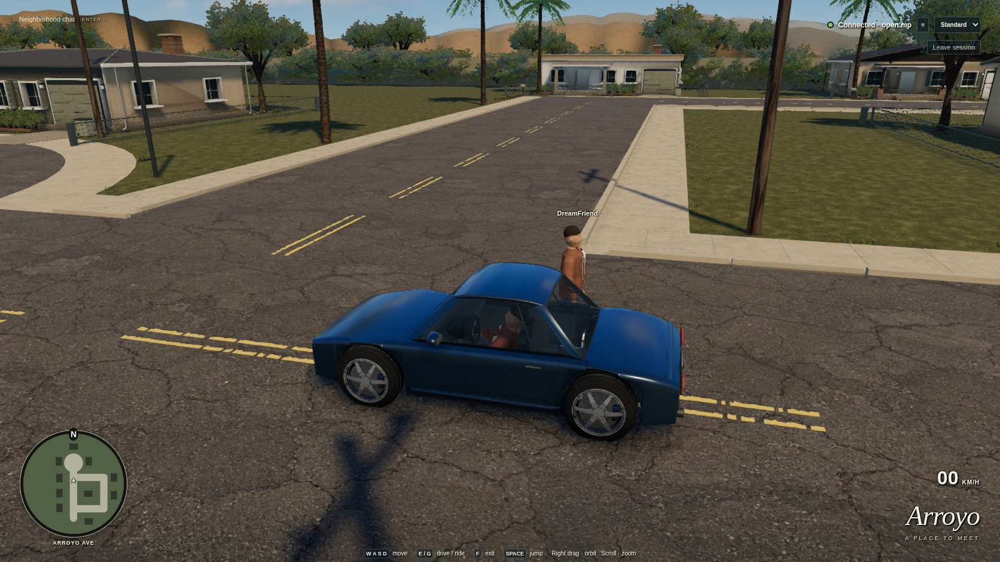

# Arroyo visual upgrade — September 8, 2026

The neighborhood now uses original detailed Blender assets, authored physical textures, warm directional lighting, cached environment reflections, native-resolution antialiasing/contact shading, and an SA-inspired interface. **The 8/10 visual target is not yet met:** the eighth independent review scores driving, pedestrian and street views **5.0/10 each**. This record distinguishes implemented improvements, measured behavior and remaining visual work.

The user reports that the game runs fine on their own machine. No hardware-GPU benchmark was collected; software-renderer measurements below are not predictions of hardware performance.

## Actual game captures

These are live Standard-mode Chrome 152 captures on the actual cloud display `:1`, at **1672×941, DPR 1**, using normal server-routed player controls. They are not generated target images. The complete capture has no browser errors; [capture metadata and screenshot checksums](visual-captures.json) identify the views. Working targets, earlier captures, traces and eight independent verdicts are in ignored `.dream-loop/`.



[Pedestrian view](images/visual-pedestrian.png) · [Rear driving view](images/visual-driving.png) · [Live entry screen](images/visual-entry.png)

[Two visible occupants from the passenger view](images/visual-passenger.png) is a separate native 1280×720 capture from the final actual-desktop verification.

## Implemented changes

- Lighting: original cloudy sky, warmer sun/cool ambient fill, 4096² directional shadows, nearby contact shading, physical roughness/normal detail and a losslessly cached neighborhood reflection atlas.
- Environment: four remodeled house variants across the unchanged ten-house layout, actual recessed front/side windows, porches and garages, local occlusion/weathering, connected asphalt fractures, low grass/soil planting, branching foliage, layered palm fronds and distant terrain watersheds.
- Vehicle and people: continuous coupe body/glass/pillar boundaries, formed wheel arches, detailed wheels and cabin; refined rigged human geometry, two outfits and fixed-step idle/walk/jump/seated animation. Vehicle dimensions, pivots and seat anchors remain unchanged.
- Presentation: lower orbiting third-person cameras, circular radar at native DPR, restrained session/speed/location information, collapsible chat and a live entry scene. There are no decorative money/ammunition/health values presented as functional systems.
- Graphics behavior: Standard defaults only for new preferences; explicitly saved Low is retained. Both presets use full viewport × native DPR, including resizing and DPR changes. Loading/retry, scene revision admission, WebGL recovery and disconnect behavior remain.
- Asset pipeline: pinned Blender 4.5.13 scripts, editable `.blend` sources, original generated texture inputs, committed GLBs/reflection cache and checksum inventory. Normal setup calls no image-generation service. See [provenance](../assets/PROVENANCE.md).

The shared playable layout and collision manifest remain unchanged. Decorative ground triangles are checked independently against roads, paths and barriers. Gameplay still travels through separate native workers and the unchanged open.mp server; animation does not add network messages.

## Verification status

**`npm run verify:poc` passed completely on September 8 at 08:49 UTC:** 15 headed browser scenarios in 41.6 minutes, 3 gateway tests, 19 scene/asset/timing checks, 3 native tests and 2 supervisor shutdown probes. The [source-hashed acceptance summary](visual-verification.json) identifies all 57 recorded source files and the native worker binary. Browser verification used Chrome for Testing 147 under Xvfb/SwiftShader. No unexpected browser errors were recorded.

| Acceptance evidence | Final result |
| --- | --- |
| Neighborhood sustained session | 92 active rounds / 600.635 seconds |
| Yard sustained session | 79 active rounds / 605.988 seconds |
| Neighborhood fresh comparisons | 200; max server difference 0.066846, max peer difference 0.020310 units |
| Yard fresh comparisons | 167; max server difference 0.492746 units, maximum server sample age 202 ms |
| Fresh reconnects | Twenty in each fixture; observed server-slot and worker release |
| Resident-tab rejoins | Twenty; 144 geometries / 30 textures / 39 programs at both first and last samples |
| Driving and lifecycle | Both neighborhood loops/role assignments, contention, safe exits, corrections, crash/restart and hidden-tab cleanup passed |

The earlier run hit its two-minute overall yard lifecycle timeout while admitting the twentieth browser after nineteen clean releases. Only that case's total allowance changed to three minutes; every cycle and individual assertion stayed. The complete clean rerun above passed. Earlier incomplete runs remain in ignored `.dream-loop/verification-failed-*/`; their results are not substituted for the final run.

**The actual cloud-desktop pass also succeeded at 09:11 UTC**, using Chrome 152 on display `:1`, native 1280×720 Standard/Low. It verified two normal players, exactly-once peer chat, walking, both visible occupants, driving, exits and worker cleanup, with zero recorded errors. Its [summary and independent server observations](visual-desktop.json) retain 4,307 observed server events by checksum and selected transitions; the vehicle moved 7.697 units from its initial position. The second attempt observed a server-confirmed driver transition in 97 ms but its animation-frame wait timed out. State observation now polls at 100 ms independently of paint, with the mode timeout unchanged. The full-suite source record remains an exact snapshot of its tested revision: only the subsequent texture-budget constant and desktop observer polling differ, and no application/asset source changed. The [budget revision and allocation breakdown](visual-budget-revision.json) record those test-only differences and verify every other recorded source hash.

Focused exported-asset checks passed before the complete run: exact vehicle anchors/envelope, animated cabin fit, four house opening cavities, canopy normal fields, planting triangle clearance, cutout mip coverage and bounded reflection-cache decoding. The full run additionally exercises graphics startup/recovery, native DPR1/2 resizing/reloading, loading failures, walking/chat/driving, both routes/seat assignments, safe exits, server corrections, failures, twenty reconnects, resident resource stability and both ten-minute active sessions. The networking threshold remains **0.5 world units within one second**. Yard gameplay and screenshots use native 1440×960 buffers; its stored test videos are encoded at 960×640. Video encoding size does not change the game drawing buffer. Neighborhood functional views use native 1280×720, and the art comparison views use native 1672×941.

## Resource measurements and explicit tradeoffs

The selected native Standard views download **46,023,763 bytes**, submit at most **5,139,319 triangles including shadow passes**, and use at most **893 draw calls**. These are measured view samples, not worst-case bounds across every possible camera. The final recorded neighborhood soak measured **0.8 FPS median / about 1,317 ms p95** in both full-native 1280×720 Low views, with **88,897,680 bytes (84.78 MiB)** logical texture storage each. The 4 FPS cloud target is missed and remains diagnostic. Without recording, a **30.515-second** sample after **10 seconds of warm-up** measured **0.9 / 0.8 FPS median**, with **1,283.3 / 1,266.7 ms p95** across the two views (26 measured frames each), with the same texture storage. The first actual-desktop Standard audit measured **284,623,808 bytes (271.44 MiB)** and correctly failed the prior 192 MiB ceiling. The pinned renderer allocates both a **64 MiB RGBA8 color attachment and a 64 MiB depth attachment** for the 4096² sun shadow; counting only the depth attachment had underestimated this cost. Environment maps, material mipmaps and native postprocessing buffers account for the remainder. The explicit logical-texture ceiling is now **320 MiB** at the tested native view sizes; larger DPR/viewports can cost more. No runtime/rendering change was made for this budget revision. The complete functional suite passed under the prior stricter limit; the fresh Standard desktop audit passed the revised ceiling in all four Standard captures. It consistently measured **271.44 MiB**; switching back to Low retained those uploaded resources for reuse. Cold Low measured 84.78 MiB as reported above. Mixed setup/preset-switching frame history is not used as a warmed benchmark.

Generated local artifacts remain under `artifacts/verification/`, `artifacts/neighborhood/`, and `artifacts/desktop-visual/` (ignored videos, traces and raw observations). Committed summaries and selected screenshots identify the delivered result.

| Resource | Initial neighborhood budget | Current explicit fidelity ceiling |
| --- | ---: | ---: |
| Scene downloads | 15 MB | 48 MB |
| Geometry | 300,000 visible triangles | 6,000,000 submitted triangles including shadow passes |
| Draw calls | 250 | 1,000 |
| Logical texture storage | 96 MiB | 320 MiB |
| Cloud median frame rate | User revised to 4 FPS | Diagnostic only |

The original budgets are exceeded. Visible faces and submitted triangles are different measurements; the latter repeats geometry for shadow rendering. The larger reflection cache trades download size for reproducible startup, while denser models, planting and expanded shadows increase rendering work. Texture storage estimates exclude driver overhead, buffers and process memory. No fidelity adjustment reduces internal resolution, and slower cloud results do not trigger downscaling.

## Art review and remaining gaps

| Fresh review | Driving | Pedestrian | Street |
| --- | ---: | ---: | ---: |
| 1 | 2.8 | 2.8 | 2.0 |
| 2 | 3.8 | 3.7 | Not judged |
| 3 | 4.4 | 4.3 | 4.1 |
| 4 | 4.7 | 4.6 | 4.4 |
| 5 | 4.8 | 4.8 | 4.8 |
| 6 | 4.8 | 4.8 | 4.9 |
| 7 | 4.9 | 4.9 | 5.0 |
| 8 | 5.0 | 5.0 | 5.0 |

All three current views pass the coarse composition gate. The light/color gate remains incomplete; 5 is its cap, not a claim that the gate passed. Repeated structural changes improved crown volume, panel construction, house recesses, ground planting, hill shading and human animation. They have not made the result visually equivalent to the generated targets.

Next visual work should address connected warm crown illumination and shaded yard depth together with coherent reflected sky/horizon on car panels. After that, improve irregular curb/paint wear, varied planting layers, terrain material regions, and convincing human hair/hands/anatomical cloth folds. More isolated color tweaks or higher-frequency texture alone will not close the review gap. The single static reflection probe also cannot reproduce position-dependent reflections everywhere on the driving loop.

Two generated foliage replacement attempts returned painted checkerboards in RGB instead of real transparency and were rejected. The valid original RGBA foliage remains. Generated targets and isolated Blender previews are authoring references only, never networking or gameplay acceptance evidence.

## Reproduce and continue

```sh
npm run setup:poc
npm run dev:poc
npm run open:poc             # optional actual cloud Chrome launcher
```

Stop the demo before `npm run verify:poc` so its fixtures own the required ports. With the demo running and no other players, use `npm run verify:desktop` for the actual cloud display. `npm run build:assets` regenerates editable models, exports and the static reflection cache without calling an image-generation service; restart the gateway after rebuilding assets.

Native GTA-world interoperability, original SA-MP/public servers, non-Chromium browsers, WAN behavior and hardware-GPU performance remain unverified. The next gameplay slices remain a server-scored checkpoint challenge, private remote invitations/latency testing, then an original-client interoperability fixture.
